# Agile Grenoble, 22 & 23 novembre 2023 - Grenoble, France

Agile Grenoble marque ma dernière participation à une conférence pour cette année 2023.  
Tout comme le Snowcamp, c'est un événement important de la sphère tech grenobloise, qui se déroule sur 3 jours : 2 journées de conférences, et une journée de forum ouvert (le vendredi, journée à laquelle je n'ai pas assisté).  
Prévoyant d'endosser officiellement un rôle de _Product Owner_ en 2024, j'ai sélectionné les talks auxquels assister en fonction.  

Différents supports et vidéos de cette édition 2023 sont disponibles sur le site de la conférence [via ce lien](https://agile-grenoble.org/agile-grenoble-2023-supports-et-videos/).

## Mercredi 22 novembre

### Keynote : L'agilité de la décroissance

**[Claude Aubry](https://claudeaubry.fr/)**

La première keynote de la journée (il y en a une à chaque début de demi-journée) est donnée par Claude Aubry. Au sein de cet appel à la sobriété qui émerge dans la tech, il vient nous parler d'agilité décroissante, dans un monde où on nous demande de faire toujours plus, plus vite.  
Il nous explique que chacun à son échelle peut participer, en choisissant de faire ou ne pas faire une user story, ou en prenant en compte de nouveaux paramètres à prendre en compte dans leur poids.  
Il évoque également la mise en opposition qu'il peut y avoir entre les adeptes de la décroissance/sobriété, et le techno-solutionnisme soutenu par Marc Andreessen par exemple.  

Claude Aubry a mis à disposition ses supports sur son site que vous pouvez retrouver [ici](https://claudeaubry.fr/series/decroissance/).

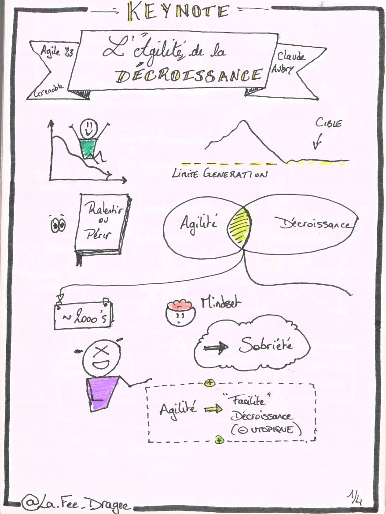  
*L'Agilité de la décroissance, sketchnote 1 sur 4*

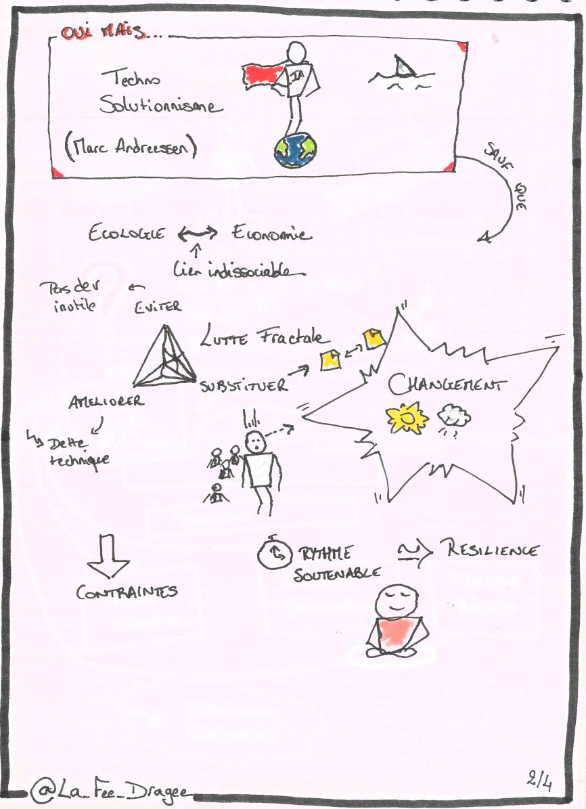  
*L'Agilité de la décroissance, sketchnote 2 sur 4*

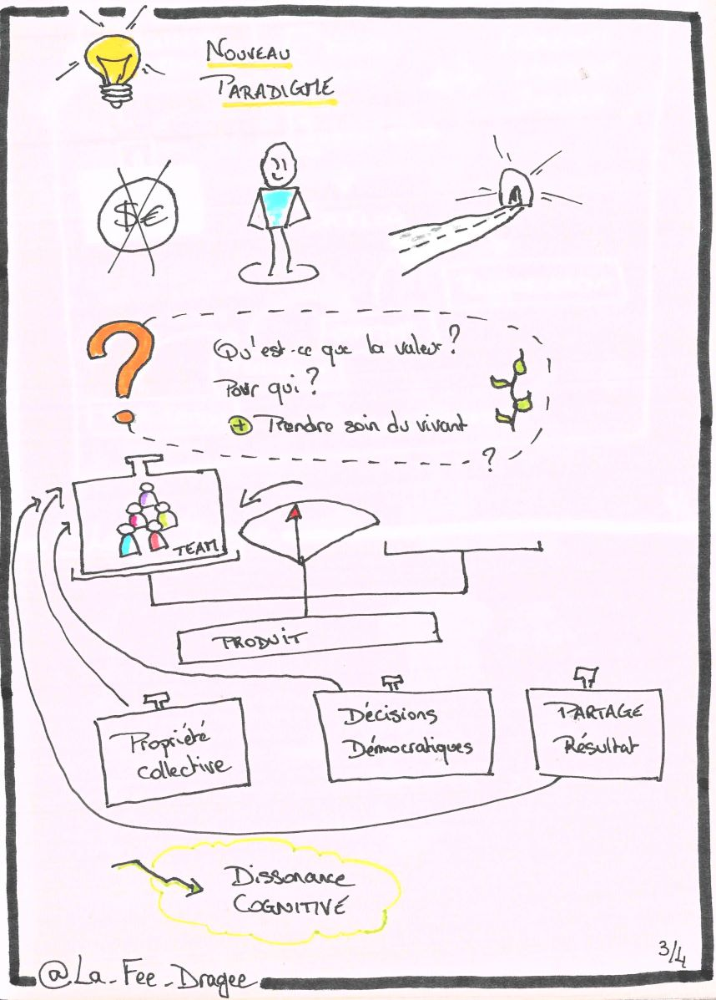  
*L'Agilité de la décroissance, sketchnote 3 sur 4*

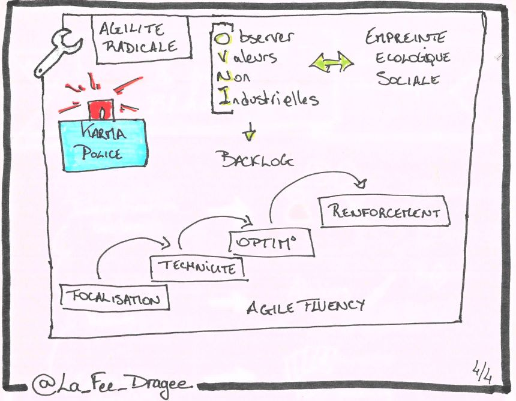  
*L'Agilité de la décroissance, sketchnote 4 sur 4*

### PO : Evitez la feuille blanche !

**[Vincent Feugier](https://www.linkedin.com/in/vincent-feugier-634a98123/?originalSubdomain=fr) et Fabien Joseph**

Plus tard dans la matinée, j'ai assisté à la présentation donnée par Vincent Feugier et Fabien Joseph qui nous ont donné quelques astuces et outils pour aider à la rédaction des _user stories_.  
Ils ont mis à disposition un workflow [juste ici](https://drive.google.com/file/d/1rOIe81ZB7s38ySXQnuH_V3nfkoY-xi65/view).  

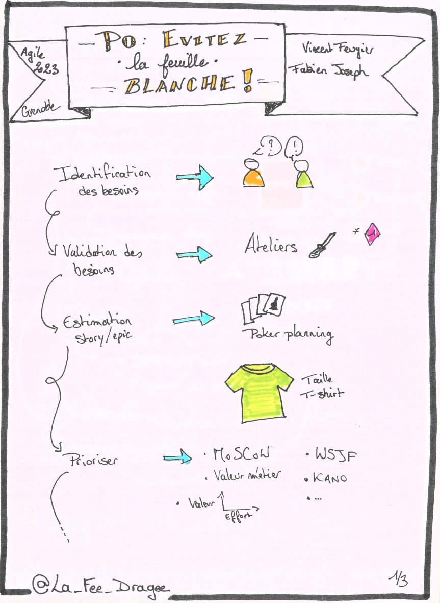  
*PO : évitez la feuille blanche, sketchnote 1 sur 3*

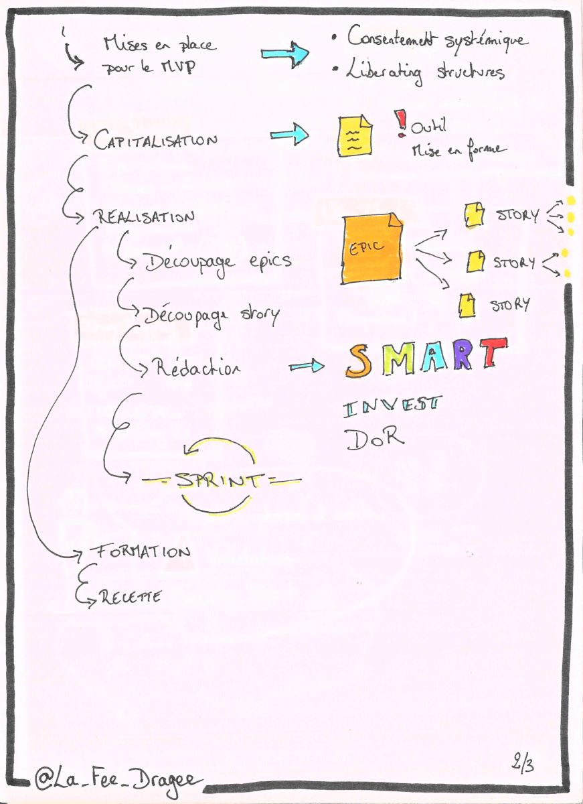  
*PO : évitez la feuille blanche, sketchnote 2 sur 3*

  
*PO : évitez la feuille blanche, sketchnote 3 sur 3*

### Keynote : Un attribut prédictif de succès des transformations : la sécurité psychologique

**[Catherine Pamphile](https://www.linkedin.com/in/balanceisinmotion/)**

En début d'après-midi, c'est Catherine Pamphile qui nous livre une keynote très touchante au sujet de la sécurité psychologique dans les entreprises. Sujet d'autant plus marquant pour moi qui suis en plein milieu d'une restructuration d'entreprise avec licenciement économique.  
Et comme pour beaucoup d'autres problèmes que l'on peut rencontrer dans notre vie, la clé est de (pouvoir) s'exprimer et dialoguer avec l'autre...  

Ses slides sont disponibles [ici](https://drive.google.com/file/d/1HB5lcLZz6-45EX59k6KqPxlbipGS_zrq/view).  

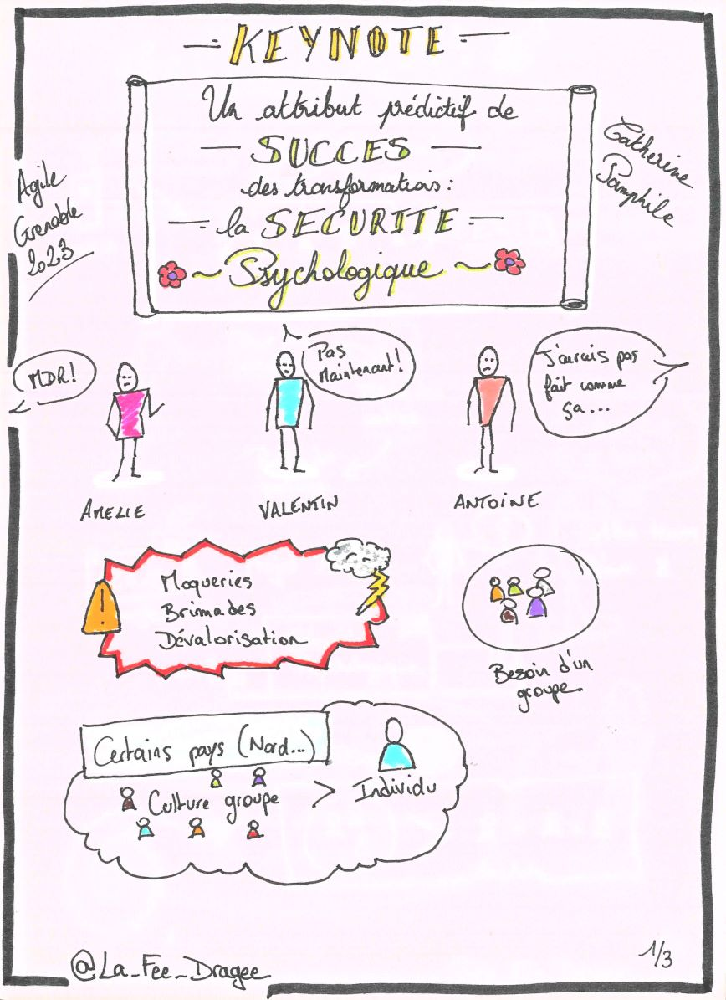  
*La sécurité psychologique, sketchnote 1 sur 3*

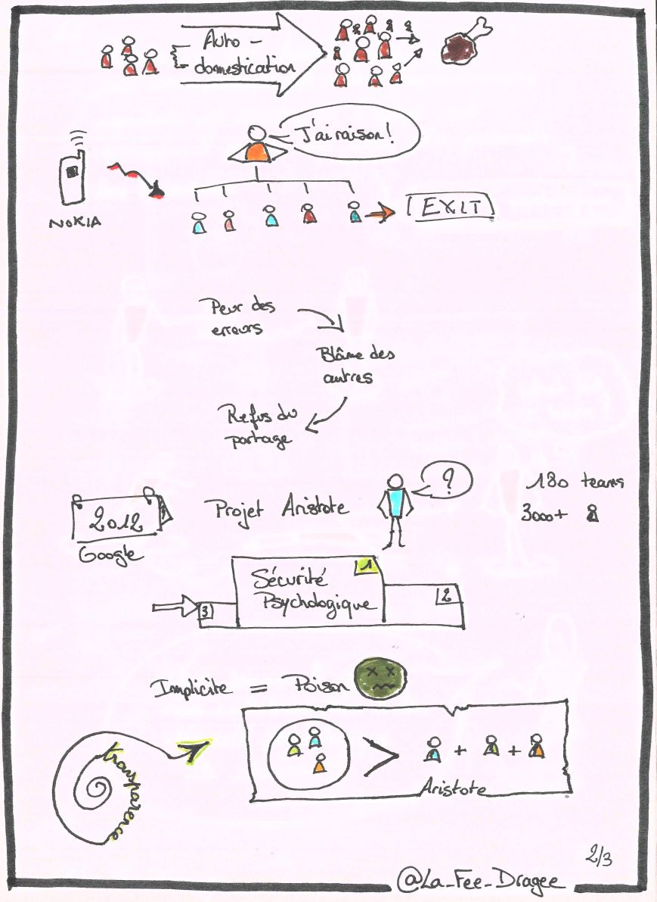  
*La sécurité psychologique, sketchnote 2 sur 3*

  
*La sécurité psychologique, sketchnote 3 sur 3*

### Quelle est la place des introverti·e·s dans un équipe agile ?

**[Anaïs Huet](https://www.linkedin.com/in/anais-huet-scrum-master/)**

Après la keynote, je suis allée voir Anaïs nous parler de son rôle de _product owner_ introvertie, et de cette image biaisée que la société veut donner aux personnalités des gens en la catégorisant forcément d'un côté (introverti) ou de l'autre (extraverti), le plus souvent en faisant entendre qu'il faut absolument être une personne extravertie pour réussir.  
Évidemment, la réalité est plus subtile que ça, et surtout l'aspect positif de l'extraversion est en réalité très récent puisqu'il serait apparu lors de la révolution industrielle.  
Elle nous a ensuite livré quelques astuces pour permettre aux personnes introverties/timides/n'osant pas s'exprimer, de participer autrement à des événements comme les brainstormings via par exemple l'écrit plutôt que l'oral, ou encore en laissant du temps pour absorber les informations (par exemple, un document de spécifications, une présentation) avant de commenter et poser des questions.
J'ai eu le plaisir d'échanger longuement avec Anaïs après sa présentation, et espère la recroiser à l'avenir !  

Ses slides sont disponibles [ici](https://drive.google.com/file/d/1mMozbTQXFx8qkbOuCxSphIYtELEd9k1E/view).  

### Comment décider ?

**[Yvan Dantec](https://www.linkedin.com/in/yvan-dantec/) et [Jérôme Froville](https://www.linkedin.com/in/froville/)**

Toujours mercredi après-midi, Yvan Dantec et Jérôme Froville nous ont parlé des différentes façons de prendre des décisions, par le biais de l'aventure d'une équipe d'astronautes coupés du reste de la civilisation. J'y ai découvert les différences entre consentement, consensus, unanimité (et quand préférer un objectif plutôt qu'un autre), ainsi que différentes méthodes de décision.  

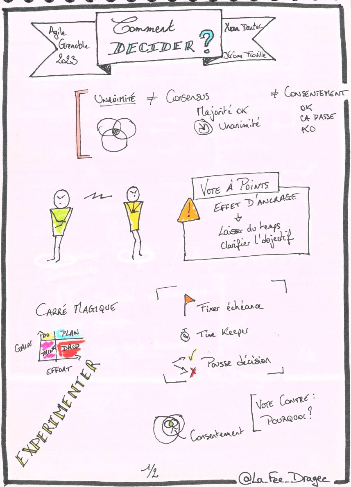  
*Comment décider, sketchnote 1 sur 2*

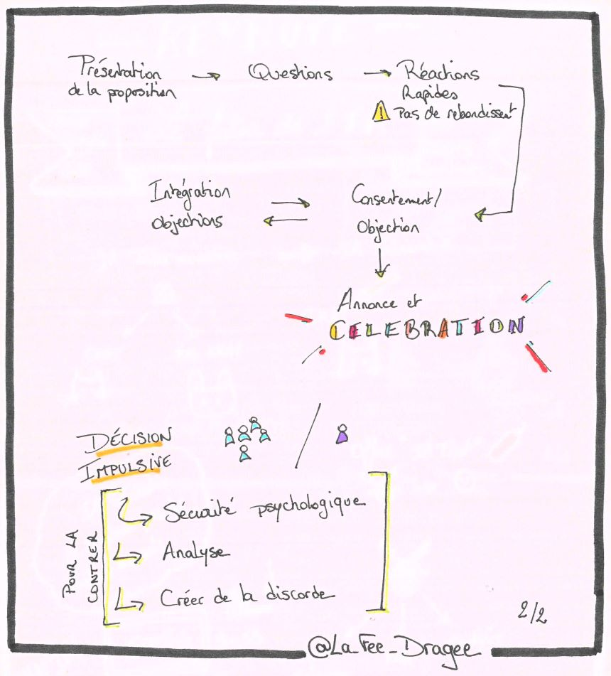  
*Comment décider, sketchnote 2 sur *

## Jeudi 23 novembre

### Keynote : Le futur de l'IA, la machine qui aide l'homme ou l'homme qui aide la machine ?

**[Ari Kouts](https://www.linkedin.com/in/arikouts/)**

La première keynote du jeudi est donnée par Ari Kouts, au sujet de l'impact de l'intelligence artificielle sur la société et le monde actuel.  
Après un rappel de l'historique de l'IA, qui est passée du mode "discriminatif" (reconnaissance d'objets par exemple) au mode "génératif" (création de contenus divers comme les images) ; nous avons demandé à [ChatDev](https://chatdev.toscl.com/) de développer un jeu de Tetris, pendant qu'Ari poursuivait sa présentation.  

J'ai été surprise d'apprendre qu'aujourd'hui déjà des IA occupent de vraies fonctions (PDG, écriture de textes religieux) dans certaines structures.  
Et si certes certains métiers risquent disparaître, d'autres apparaîtront, comme cela arrive couramment dans l'histoire des sociétés modernes.  

Nous avons pu voir le résultat produit par ChatDev, avec le prompt de tous les échanges entre les différentes entités simulées (dev, test, archi...).  
En terme de coût pour ce développement, cela représentait une dépense de moins de 1$, remettant en cause toute l'économie actuelle de l'IT. En revanche le "vrai" coût sociétal et environnemental est lui tout autre...

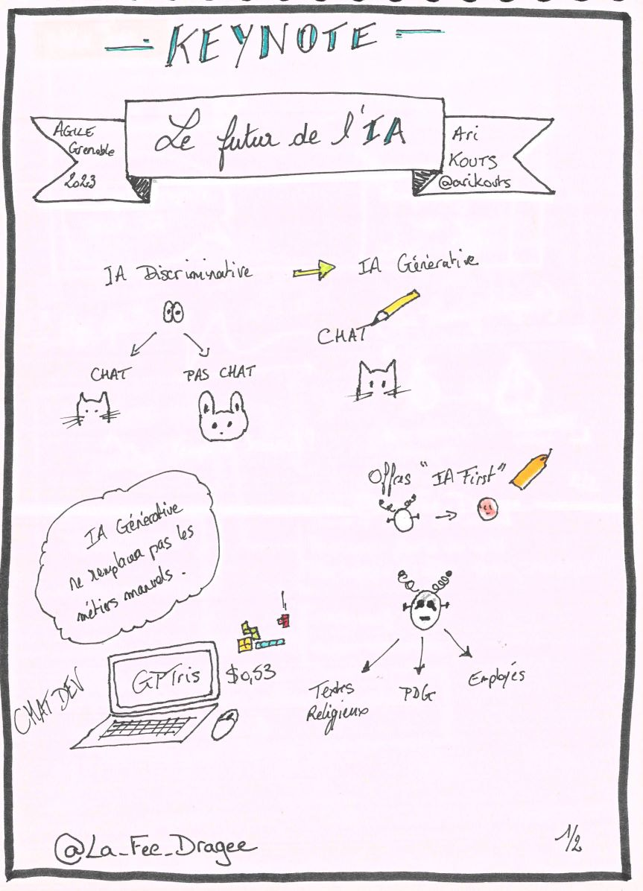  
*Le futur de l'IA, sketchnote 1 sur 2*

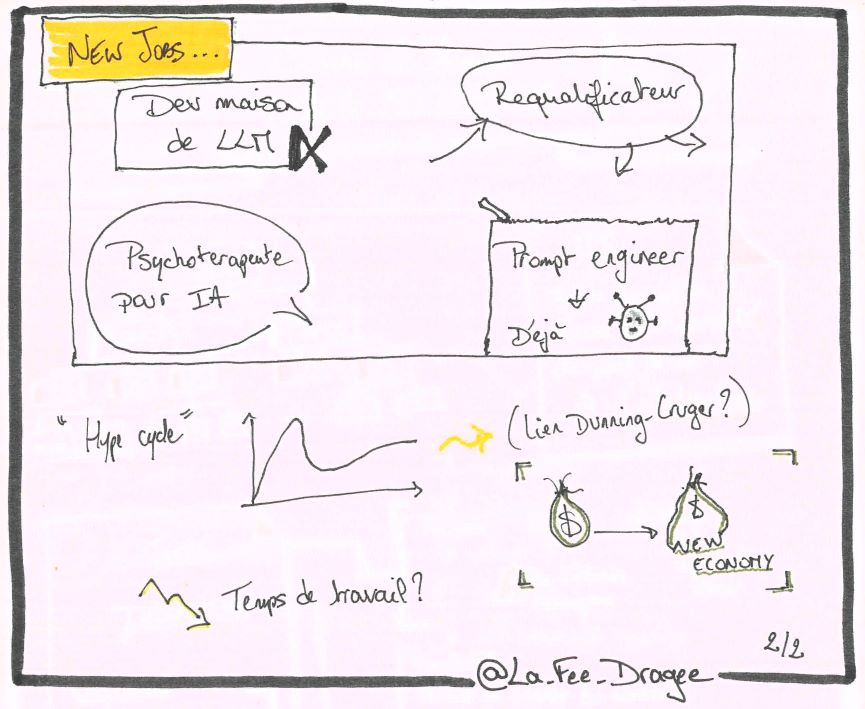  
*Le futur de l'IA, sketchnote 2 sur 2*

### Découper ses _user stories_

**[Gladys Niarfeix](https://www.linkedin.com/in/gladys-chardon-niarfeix-9128293b/)**

Après la keynote, je suis allée assister à la présentation de Gladys Niarfeix qui nous a proposé quelques idées pour découper les _stories_ trop volumineuses.  
Nous avons revu les bases de la définition d'une _user story_, quels critères nous pouvons utiliser pour déterminer si une _story_ est bonne ou mauvaise, et nous a ensuite présenté le split poker, qui donne plusieurs possibilités de découpage, que je vais garder sous le coude précieusement !  

Ses slides sont disponibles [ici](https://drive.google.com/file/d/1i8g893PYiV22ZnEjVBkw0IFasOzO8Peg/view).  
Le split poker est disponible [ici](https://www.neosoft.fr/nos-publications/livres-blancs/split-poker-decoupage-fonctionnel-serious-game/).  

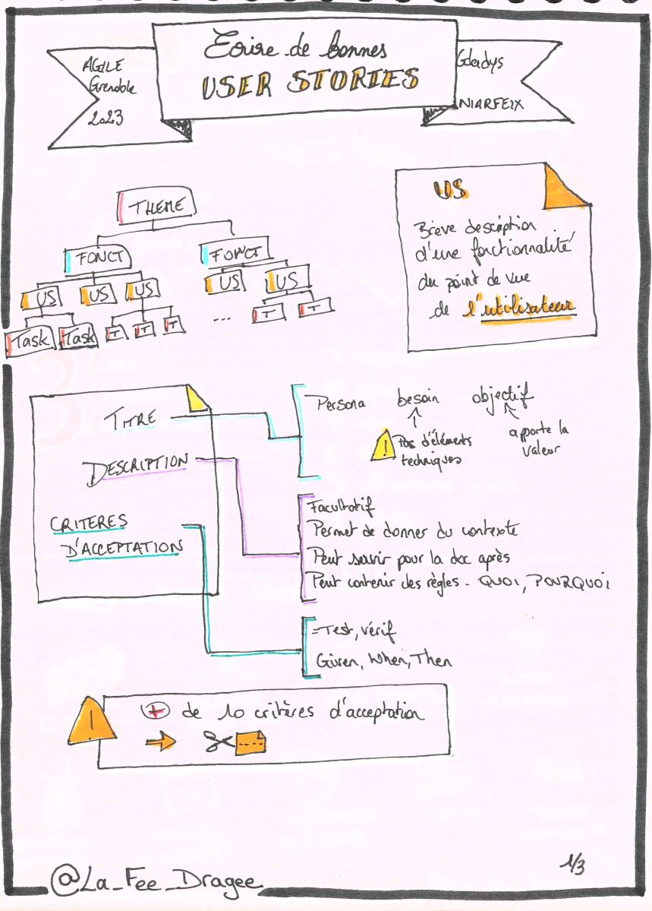  
*Bien découper ses _user stories_, sketchnote 1 sur 3*

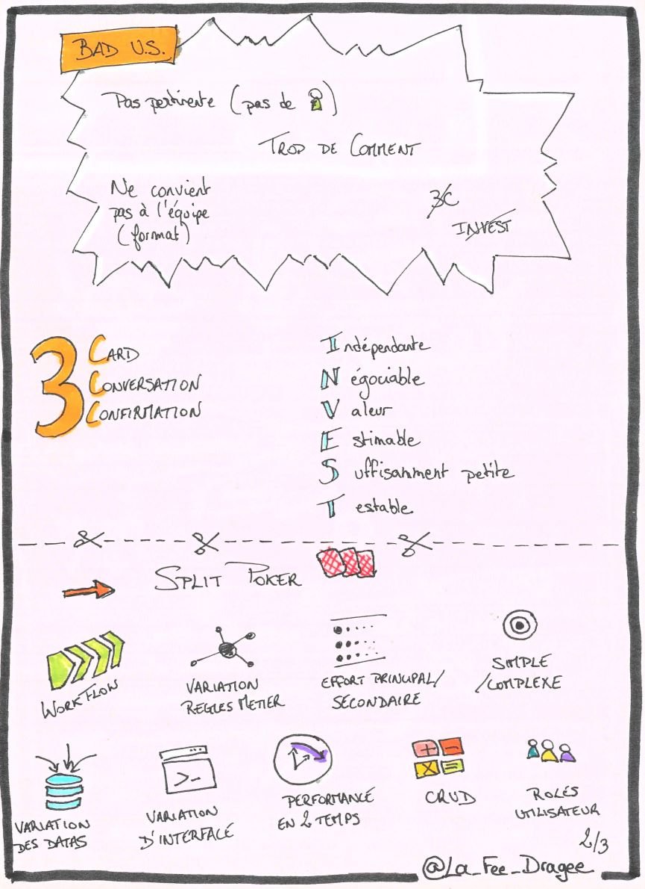  
*Bien découper ses _user stories_, sketchnote 2 sur 3*

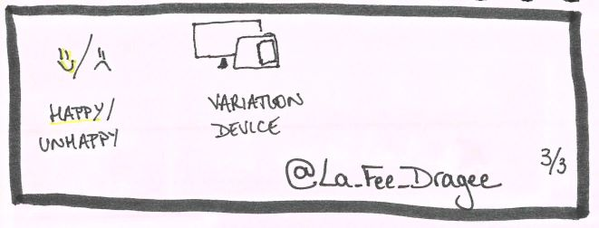  
*Bien découper ses _user stories_, sketchnote 3 sur 3*

### Rôles agiles : quand les périmètres s'emmêlent, tout dérape !

**[Elise Faramia](https://www.linkedin.com/in/elise-faramia-69a0a958/) et [Patrick Pouchol](https://www.linkedin.com/in/papoucho/)**  

Maintenant que le découpage des stories n'a plus de secrets, place à la gestion des périmètres de chacun dans une entreprise, et surtout les risques lorsqu'il y a superposition de rôles/casquettes, et comment s'en débarrasser (des casquettes, pas seulement des risques).  
Au travers de deux exemples, nous avons vu quelles casquettes pouvaient être amenées à se superposer et être sources de problèmes : le rôle de _Scrum Master_ qui se retrouve également _Project Management Officer_, et le rôle de _Product Owner_ couplé au "couteau suisse".  
Encore une fois, ce que j'en retiens c'est que la clé c'est le dialogue, l'entraide et le soutien au sein de l'équipe.  

Les slides sont disponibles [ici](https://drive.google.com/file/d/1Ex9Y8d-2_EzNC0hGLhgtr7ItA9wdkKOi/view).

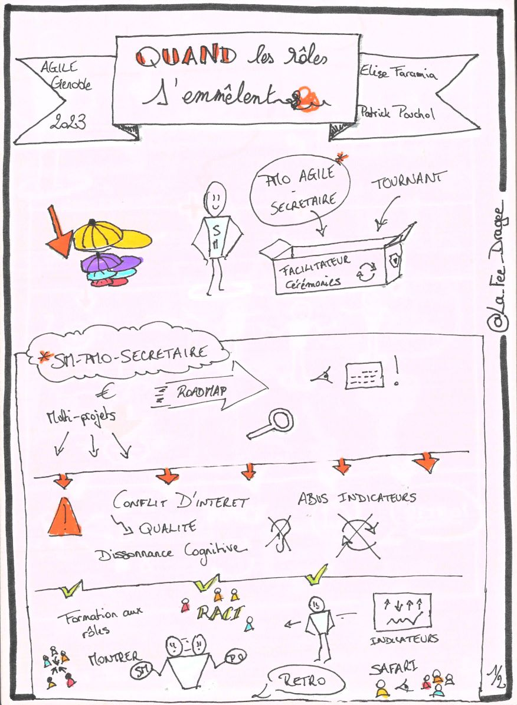  
*Quand les rôles s'emmêlent, sketchnote 1 sur 2*

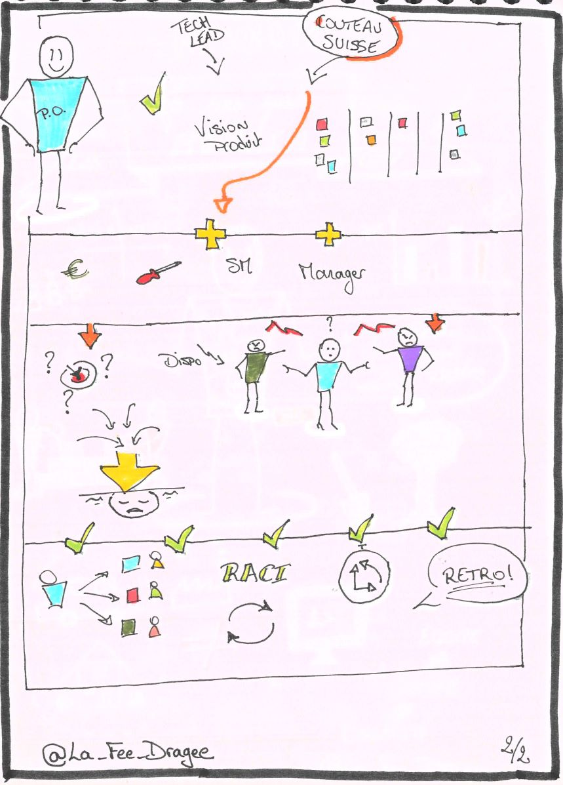  
*Quand les rôles s'emmêlent, sketchnote 2 sur 2*

### Keynote : Je suis juste humain

**[Benjamin Cabanne](https://www.linkedin.com/in/bcabanne/)**

La dernière keynote est présentée par Benjamin Cabanne, qui nous a rappelé en toute humilité que nous sommes juste humains.  
Nous ne sommes pas infaillibles, nous sommes composés de plusieurs facettes, nous nous élevons dans nos interactions avec les autres, nous avons besoin les uns des autres.  
Et quand chacun peut exprimer sereinement ses besoin et ses peurs au lieu de chercher à avoir absolument raison, alors c'est à ce moment-là que nous pouvons avancer et petit à petit construire une équipe.  

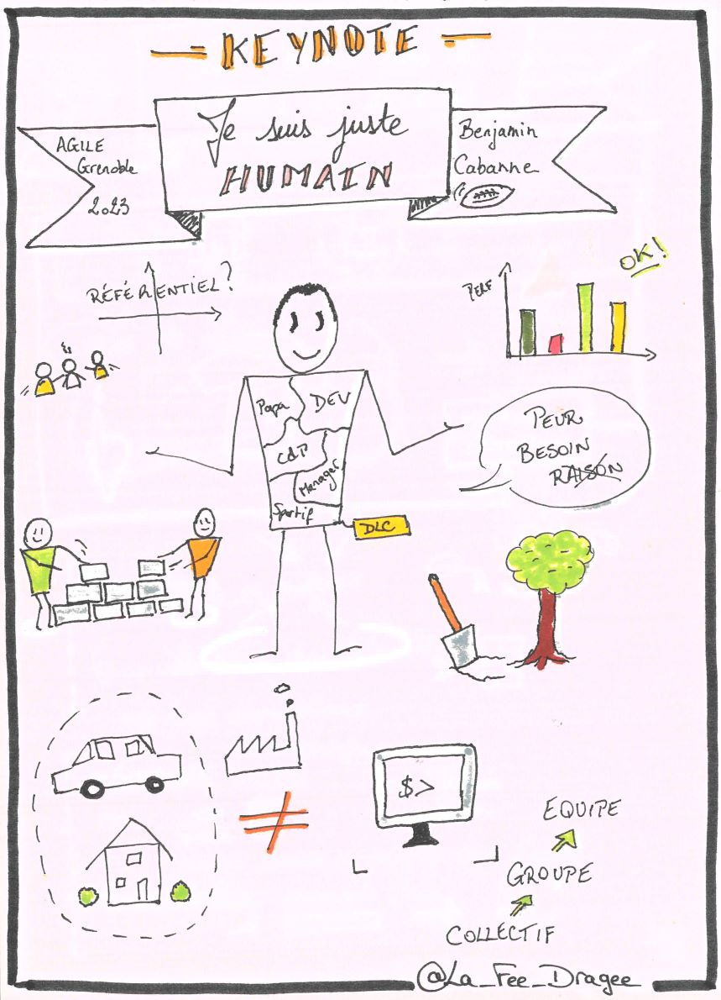  
*Je suis juste humain, sketchnote*

### Mon petit fail : libère ta créature et embrasse tes bizarreries

**[Cyrielle Eudeline](https://www.linkedin.com/in/cyrielle-eudeline-50608368/) et [Maria-Eliza Paez](https://www.linkedin.com/in/maria-paez/)**

Jeudi après-midi j'avais prévu de participer à l'atelier présenté par Cyrielle Eudeline et Maria-Eliza Paez, centré sur la neurodiversité.  
Manque d'anticipation de ma part, l'atelier était déjà complet lorsque j'ai voulu m'installer dans la salle !  
J'espère vraiment avoir une nouvelle occasion d'y participer, en attendant quelques slides sont disponibles [ici](https://drive.google.com/file/d/1JIo5kNFwnFYJghJPBfLwtP3vC7VVtqf9/view).  

> Edit avril 2024 : j'ai pu y assister lors du [MiXiT](../../2024/MiXiT/README.md), et c'était top !

### Nous n'estimons plus et tout va bien !

**[Antoine Comble](https://www.linkedin.com/in/antoine-comble-90353447/)**

N'ayant donc pas pu assister à l'atelier sur la neurodiversité, je suis allée écouter Antoine Comble expliquer pourquoi et comment il ne fait plus d'estimation des stories sur certains projets, et quels bénéfices les équipes en tirent.  
Ce que je n'avais pas en tête, c'est qu'au final ce dont les décideur·euses ont besoin c'est d'un délai grosses mailles pour la disponibilité d'un développement.  
Et cette information ne nécessite pas forcément que les _stories_ soient estimées, il suffit juste d'avoir suffisamment d'historique pour avoir une idée du nombre d'éléments terminés en un certain laps de temps.  
Nous avons vu quelques outils et formules de calcul permettant d'obtenir ces informations, qui peuvent même être constamment à disposition des décideur·euses.  

Ses slides sont disponibles [ici](https://drive.google.com/file/d/18R4c0N6KOsJ1tco9ZopHWwzIr-tX_rp-/view).  

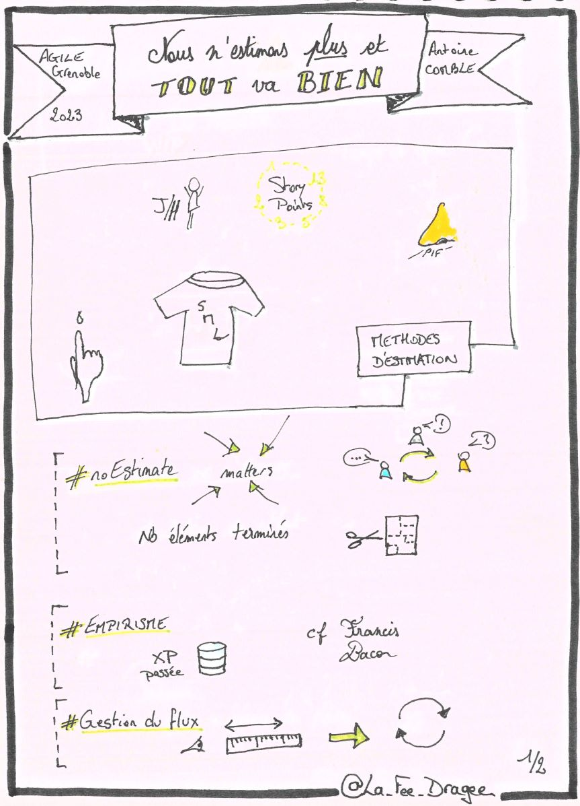  
*Nous n'estimons plus et tout va bien, sketchnotes 1 sur 2*

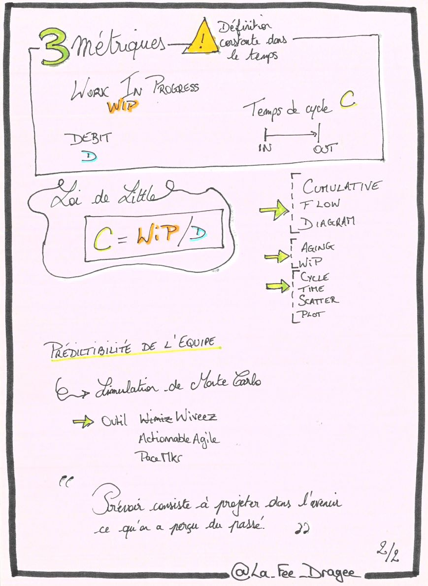  
*Nous n'estimons plus et tout va bien, sketchnotes 2 sur 2*

### Antidette

**[Nicolas Tondeur](https://www.linkedin.com/in/ntondeur/) et [Camille Marquette](https://www.linkedin.com/in/camille-marquette-000244156/)**

Pour finir cette édition 2023, je suis allée essayer le _serious game_ "Antidette", proposé par le GAG (Groupe d’Agilisation et de Gamification).  
Ce jeu de deck building vise à matérialiser la dette technique, et ses effets sur la productivité d'une équipe.  
Il n'est pas uniquement destiné aux équipes agiles, et peut (doit ?) à mon sens également être utilisé pour sensibiliser la hiérarchie à l'impact de la dette technique sur le produit.  
En 45 minutes, nous avons juste eu le temps d'effleurer le gameplay, je pense qu'il est mieux de le faire en atelier de 2 heures. Néanmoins j'ai trouvé que la mécanique fonctionnait bien, et permettait vraiment bien de matérialiser la dette technique et ses effets.  

Le jeu est disponible [ici](https://www.hacoeur.biz/hacktivite-antidette-v1-0/).  

## Ma conclusion

Cette édition 2023 a été assez intense, j'y ai appris et découvert beaucoup de choses, que j'ai hâte et très envie de pouvoir expérimenter et partager à mon tour dans ma vie professionnelle.  
A l'année prochaine Agile Grenoble !  