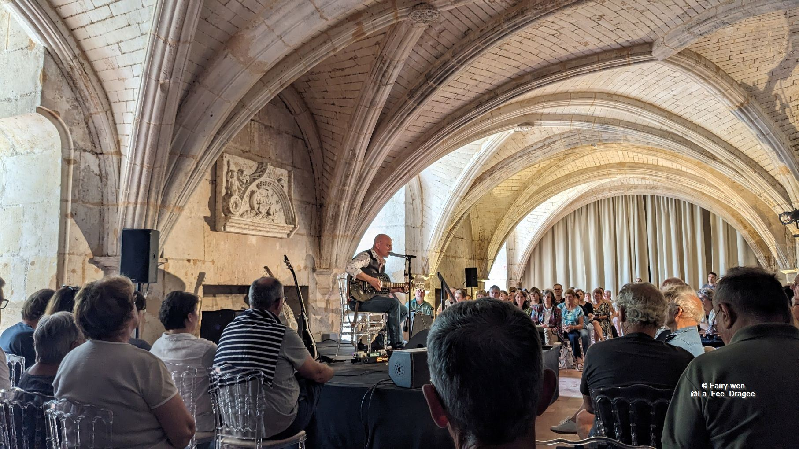

# Cognac Blues Passions, 4 au 9 juillet 2023 - Cognac, France

_[Rédaction en cours]_

Le [Blues Passions](https://www.bluespassions.com/), c'est un peu une institution ici à Cognac, ville où j'ai grandi.
Depuis 30 ans cette année, ce festival fondé par Michel Rolland devenu incontournable pour les locaux permet à tous de découvrir petits et grands noms du blues, grâce à de nombreux concerts gratuits et payants qui prennent place en ville.

J'y ai découvert au fil des ans plusieurs artistes et groupes que je continue de suivre aujourd'hui, et que je vais voir avec plaisir lorsqu'ils se produisent près de chez moi.

En découvrant la programmation de cette 30ème édition, je n'ai pas pu résister à l'envie de prendre le pass anniversaire m'ouvrant les portes à tous les concerts ainsi qu'à quelques cadeaux, une semaine bien chargée en perspective !

Suivez-moi dans le récap de cette aventure !

## Les scènes du festival

### Jarnac, pour la soirée d'ouverture

Chaque année, le festival débute avec une soirée d'ouverture sur l'Île Madame, située sur la Charente, à Jarnac.
Ce lieu accueille uniquement la soirée d'ouverture, tous les autres concerts prennent place à Cognac.

### Groove au château

Du mercredi au samedi à 14h30, la salle des gardes du château de Cognac (lieu de naissance du roi François Ier) accueille un concert en petit comité, sous les voûtes probablement dessinées par Léonard de Vinci (grand ami et protégé de François Ier).

C'est un lieu vraiment unique et très beau, que j'ai eu l'occasion de parcourir maintes fois alors que j'y étais guide touristique.
Autrefois lieu de vie et de réception de la royauté, il a également servi de prison lors de la guerre de 7 ans, et abrite aujourd'hui des chais de vieillissement pour les marques de cognacs Baron Otard (qui a racheté le château à l'abandon en 1795), et D'Ussé (créée en 2013).

### 1715 Avenue du Blues

Cette scène est elle aussi hébergée par une des plus anciennes maison de cognacs : Martell (fondée en 1715).
Située dans la cour intérieure, elle peut accueillir 1700 spectateurs lors des concerts à 18h15, du mercredi au samedi également.

### Jardin public

C'est au jardin public que l'on retrouve la majorité des concerts, gratuits en début de journée, puis payants à partir de 18h.
Ici, on écoute la musique pieds nus, assis dans l'herbe. On peut croiser quelques artistes qui circulent sur le site en attendant de jouer plus tard dans la journée, certains s'invitent même les uns les autres sur scène au gré des rencontres.

Il y a évidemment à manger, et à boire. Principalement du cognac (pur, en cocktail, en long drink), l'événement étant largement sponsorisé par les 3 plus grosses maisons Hennessy, Rémy Martin et Martell.

Le site du jardin public propose 3 scènes de différentes tailles : 2 "petites", et une principale au cœur d'une théâtre nature.

### Dans les rues

La musique est également dans les rues, avec une fanfare qui déambule un peu partout dans la ville et plusieurs scènes hébergées par les restaurants alentours, permettant de profiter de la musique le soir à table.

## Mardi 4 juillet

Cette soirée d'ouverture se déroule donc à Jarnac, sur l'Île Madame.
J'ai pu profiter de 3 formations différentes ce soir-là, avec des styles assez différents les uns des autres.

### The Blue-Footed Boobies

Il s'agit d'un quatuor formé par Marko Balland (l'harmonica), Ronan One Man Band (guitare et chant), Pascal Blanc (basse) et Guillaume Dupré (batterie).
Une formation somme toute assez courante et efficace pour du blues qui nous transporte grâce à la voix grave et rocailleuse de Ronan, on en redemande !

[https://www.facebook.com/people/The-Blue-Footed-Boobies/100059640285850/](https://www.facebook.com/people/The-Blue-Footed-Boobies/100059640285850/)

### Cisco’s Blues & Beat Box Band

Cisco Herzaft n'est pas loin d'être un des doyens de ce festival, du haut de ses 76 ans. Pour cette soirée du Blues Passions, il est entouré de [Geneviève Dartevelle](https://www.facebook.com/profile.php?id=100042338991168) à l'harmonica, [Stéphane Bihan](https://stephanebihan.fr/) à la contrebasse et [MicFlow](https://www.facebook.com/MicflowBeatbox) au beatbox.
Un cocktail efficace, avec un super démo de beatbox par MicFlow en solo. J'étais également très heureuse de voir une femme à l'harmonica (ne nous le cachons pas, la musique blues est souvent faite par des hommes), d'autant plus que Geneviève a plusieurs cordes à son arc et joue également de la scie musicale et de la guimbarde.
Cisco quant à lui nous a raconté quelques origines du blues, et notamment du ragtime fingerpicking étape par étape.

Un concert plein de découvertes donc 😀

[https://www.facebook.com/ciscoherzhaftofficiel](https://www.facebook.com/ciscoherzhaftofficiel)

### Michel Jonasz

THE artiste de la soirée, c'est bien sûr Michel Jonasz (du même âge que Cisco Herzaft). J'avoue ne connaître que quelques-une de ses chansons, et me sentais un peu seule au milieu d'une foule de fans qui les connaissaient toutes par cœur, mais j'ai quand même beaucoup apprécié le spectacle !
Sur scène, il est entouré de nombreux musiciens dont Jean-Yves d’Angelo aux claviers et Manu Katché à la batterie.
Le spectacle est à la hauteur des attentes (malgré les petites averses de pluie qui se sont invitées à la partie) : des arrangements superbes, une excellente prestation scénique, des histoires à raconter au public, un son parfait.

Je suis ravie d'avoir eu l'occasion de voir ce spectacle !

[https://www.micheljonasz.com/](https://www.micheljonasz.com/)

## Mercredi 5 juillet

### Nico Wayne Toussaint

Je commence cette journée de mercredi par le _Groove au Château_ avec le concert de Nico Wayne Toussaint.  
Né à Toulon, cet harmoniciste réputé dans le monde du blues s'est mis à la guitare depuis peu afin d'arriver à restituer la musique qu'il imagine.  
Plein d'énergie, très souriant et sympathique, il a su mettre l'ambiance au château, tantôt en guitare-voix, guitare-harmonica voire harmonica seul.  

Je retournerai le voir avec grand plaisir quand j'en aurai l'occasion !

[https://www.nicowaynetoussaint.com/](https://www.nicowaynetoussaint.com/)

### JP Bimeni 

La journée se poursuit avec JP Bimeni chez Martell. Du chant, des guitares, de la batterie, de l'orgue et des cuivres pour une ambiance soul et funk parfaite pour danser !  
Je n'ai malheureusement pas suivi de très près le concert, étant accompagnée par ma fille qui n'a pas lésiné sur les chorégraphies dans la cour 💃  
Néanmoins je sais ce que j'écouterai pour me donner la patate 👍  

[https://jp-bimeni.com/fr/](https://jp-bimeni.com/fr/)

### Vicious Steel Fuel Band

Le concert précédent ayant pris fin un peu en retard, je n'ai vu que la fin de la prestation de ce groupe français assez décalé et très dynamique 🔥.  
Je note particulièrement la tenue de scène en bleu de travail, et le capot de tracteur transformé en guitare électrique

[http://www.virguleprod.com/vicious-steel/](http://www.virguleprod.com/vicious-steel/)

### Placebo

La tête d'affiche ce soir-là était le groupe britannique Placebo, qu'on ne présente plus.  
Sur scène, beaucoup plus de guitares que de musiciens, et un enchaînement des titres à la seconde près. Il nous était interdit de prendre des photos durant le concert, je n'ai donc aucune image à montrer de cette prestation.  

Même si j'ai apprécié entendre des morceaux que je n'avais pas écoutés depuis bien longtemps, je n'ai pas trouvé de grand intérêt à voir ce groupe en live.  
Peu ou pas d'échanges avec le public, le chanteur Brian Molko qui change de guitare à chaque morceau sans que j'entende une franche différence, et à mon souvenir pas non plus de réorchestration des morceaux proposés...  
Cependant dans la fosse l'ambiance chez les fans semblait au top, tant mieux pour eux !  

[https://www.placeboworld.co.uk/](https://www.placeboworld.co.uk/)

## Jeudi 6 juillet

### William Crighton

Au château, j'ai assisté au concert de William Crighton, qui jouait par ailleurs en groupe le vendredi soir au jardin public.  
Nous étions sur un style blues calme, avec des morceaux plutôt oniriques, mais quelquefois avec trop de réverbération dans un des micros à mon goût, qui devait se mélanger à la résonance naturelle de la salle voûtée, pénalisant mon expérience. 
En revanche j'étais bluffée par la puissance de sa voix, dont le timbre m'a rappelé un peu celui de Charlie Winston. Les mélodies et les histoires m'ont transportée, notamment sa chanson _Julienne_, dédiée à son épouse (qui d'ailleurs joue avec lui en version full band). 

[https://williamcrightonmusic.com.au/](https://williamcrightonmusic.com.au/)

### Tiwayo

Sur la scène du 1715 de Martell, c'est Tiwayo qui s'est produit ce soir-là, en formation à 4 (2 guitares, basse et batterie).  
Un répertoire à la fois folk et groove, une voix qui "frotte" un peu sans être grave ni rauque, pour une très représentation très agréable.  

[http://tiwayo.com/](http://tiwayo.com/)

### Ibeyi

Lors du premier concert du soir au jardin public, j'ai écouté le duo Ibeyi formé par les sœurs jumelles Lisa-Kaindé et Naomi, françaises d'origine cubaine et dont le père était percussionniste du _Buena Vista Social Club_.  
Une vraie découverte qui m'a profondément marquée, pour plusieurs raisons. Leur talent, leurs timbres de voix chaleureux, le générosité sur scène, leur complicité et complémentarité et j'en passe. Sans oublier bien sûr la qualité de leurs compositions et les arrangements musicaux.  
Elles nous ont présenté un répertoire très varié, venant du plus profond des tripes, mêlant influences cubaines, R&B, Hip Hop ou encore soul. Elles m'ont complètement embarquée dans leur univers, et font partie de mes grands coups de coeur de cette édition.  
**Foncez les découvrir sur scène, vraiment !**  

[https://ibeyimusic.com/](https://ibeyimusic.com/)

### MC Solaar New Big Band Project

Quand j'ai vu que le grand MC Solaar présentait ses plus grands succès entouré d'un big band, je me suis dit qu'il fallait absolument que je découvre ça.  
Née à la fin des années 80, MC Solaar a bercé mon adolescence comme celle de mes camarades de classe de l'époque.  
Le résultat a vraiment été à la hauteur. Les arrangements d'Issam Krimi, à l'origine de ce projet, sont magnifiques. Le flow d'MC Solaar est toujours super net, les textes n'ont pas pris une ride, les choristes exceptionnelles, et tout ça sans perdre la côté percutant, avec une interprétation de _Solaar pleure_ encore meilleure que l'original.  
Pour dire l'ambiance, ma montre connectée a détecté un entraînement sportif durant le concert XD. 

Bref, un retour 25 ans en arrière pour moi, et j'attends avec impatience la sortie d'une version album de ce show, si jamais elle est prévue un jour.  

En attendant, le spectacle donné à la Philarmonie de Paris est disponible sur _arte CONCERT_ : [https://www.arte.tv/fr/videos/111708-000-A/mc-solaar-symphonique-a-la-philharmonie-de-paris/](https://www.arte.tv/fr/videos/111708-000-A/mc-solaar-symphonique-a-la-philharmonie-de-paris/)  

### Liz Mandeville

MC Solaar avait tellement mis le feu que j'avais plein d'énergie à dépenser, j'ai donc fini la soirée en allant judicieusement écouter Liz Mandeville.  
Je n'ai que deux mots : "Hell yeah 🤘". Liz, c'est une femme de talent, drôle, haute en couleurs, qui n'a pas sa langue dans sa poche et envoie du lourd avec son blues et rockabilly _old fashionned_ comme on aime et qui vous font danser jusqu'au bout de la nuit (y compris mon père, qui n'est habituellement pas du genre à se trémousser ^^) !  

Bref, une valeur sûre, et qui assure !  

[https://www.lizmandeville.net/](https://www.lizmandeville.net/)

## Vendredi 7 juillet

Certainement la journée que j'attendais le plus, puisque c'est ce jour-là que se produisait Matthieu Chedid (dit -M-), que j'écoute et suis depuis de nombreuses années.  

Mais avant lui, je suis allée voir d'autres artistes.  

### Imany

Quelle expérience ! Vous l'avez peut-être entendue dans les années 2010 avec ses titres _You Will Never Know_ et _Don't Be So Shy_.  

Durant ce concert au Blues Passion, elle présente son spectacle _Voodoo Cello_, un ensemble de reprises (de ses propres titres comme d'autres chansons), accompagnée par 8 violoncelles, qui ont joué debout (et sous un soleil de plomb !) durant tout le set.  
J'ai vraiment beaucoup apprécié le spectacle, tant au niveau musical ue visuel.
La voix chaleureuse d'Imany se mariait parfaitement avec le timbre des violoncelles, et j'ai beaucoup aimé les arrangements et son interprétation.  

[https://imanymusic.com/](https://imanymusic.com/)

### Electric Ladyland - _Hommage à Hendrix au féminin_

Comme l'indique le titre, Electric Ladyland est un projet d'hommage au grand Jimmy Hendrix, proposé par un line-up exclusivement féminin (et ça fait du bien !):  Nina Attal (guitare), Antonella Maza (basse), Swanny Elzingre (batterie), Léa Worms (claviers), Chantel Mc Gregor (guitare), Jessie Lee (guitare) et Léna Woods (harpe électrique).  

Ne connaissant quasiment pas la musique d'Hendrix, je ne saurais dire si le contrat est rempli d'un point de vue "hommage", en tous cas du point de vue performance musicale il l'était malgré quelques longueurs ressenties en raison des nombreux solos et quelques discours parfois longs qui me faisaient décrocher.  
J'ai tout de même grandement apprécié la prestation !  

[https://zamoraprod.com/fr/artistes/electric-lady-land-hendrix-au-feminin](https://zamoraprod.com/fr/artistes/electric-lady-land-hendrix-au-feminin)

### -M-

Pour être totalement objective (non), les concerts de -M- sont toujours extraordinaires. 
D'abord parce que c'est un excellent musicien, auteur, compositeur.
Ensuite parce que les musiciens qui l'entourent sont également excellents, et que Matthieu Chedid leur laisse toujours une place au devant de la scène durant ses concerts.
Et surtout parce qu'il sait mettre une ambiance de folie, et créer un vrai lien avec son public en venant jouer tout au bord de la scène ou encore au milieu de la foule.  

J'avais déjà eu le plaisir de le voir au Blues en 2014, et je n'ai pas boudé mon plaisir en 2023 !
Et pas seulement parce que je suis une grande amatrice de son travail, mais aussi parce que le concert proposé était vraiment génial. Je garde notamment l'interprétation de _Life On Mars_ par Gail Ann Dorsey, bassiste qui a joué de longue années aux côtés de David Bowie (mais pas que !). Et bien sûr, _La belle étoile_, éclairée uniquement avec les lumières de nos téléphones, pour un moment magique.  

Vivement la prochaine fois !  

[https://labo-m.net/](https://labo-m.net/)  

## Samedi 8 juillet

### Déambulation Ooz Band

Lors du festival, il n'y a pas que des concerts "standard", il y a également des animations dans les bars, cafés et restaurants de la ville, ainsi que des déambulations, comme celle du brass band Ooz Band.  
Ce samedi, ils proposaient leur animation dans la cour du château, nous permettant d'attendre l'ouverture des portes dans la joie et la bonne humeur !  

[https://www.oozband.com/](https://www.oozband.com/)

### Jerron Paxton

Pour le groove au château du samedi, c'était au tour de Jerron Paxton de nous ravir.  
Multi-instrumentiste de talent (piano, harmonica, banjo, violon...), il nous a proposé un blues _old-fashionned_ du début du XXème siècle, que j'apprécie particulièrement.  
Un vrai voyage direction la Louisiane des années 1920/1930, c'est ça aussi la magie de la musique et du festival : se laisser transporter dans le temps et l'espace, et découvrir le monde d'une autre façon. 

[https://www.jerronpaxton.com/](https://www.jerronpaxton.com/)

### Reste de la journée

Je n'ai pas réellement assisté aux autres concerts de cette soirée, puisque les quelques spectateurs qui comme moi avaient pris un pass spécial anniversaire ont été invités à partager un verre avec Michel Rolland, le créateur du festival.  
Le reste de la soirée j'étais accompagnée de ma fille, nous avons donc plutôt partagé un moment dansant ensemble.

## Dimanche 10 juillet

Un jam géant était organisé tout au long de cette journée, ainsi que plusieurs concerts gratuits. 
Malheureusement je devais reprendre la route et n'ai donc pas pu y participer, ni goûter le croc-en-bouche géant préparé pour l'occasion. La prochaine fois peut-être !

## Les cadeaux

_[À venir]_