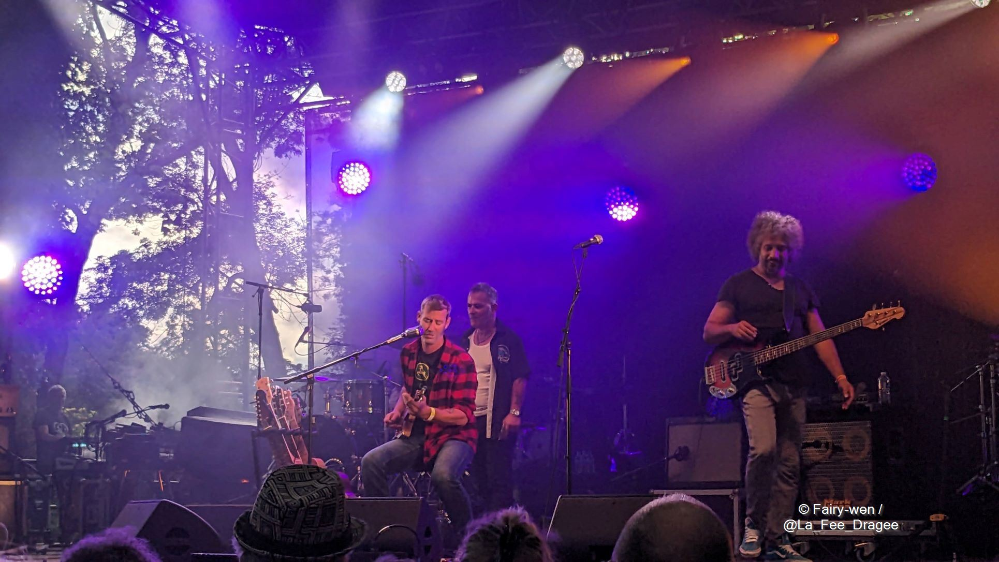
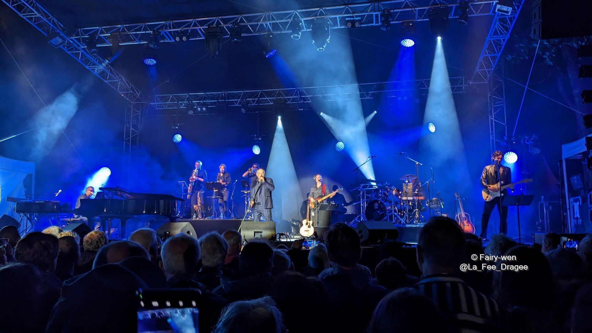

# Cognac Blues Passions, 4 au 9 juillet 2023 - Cognac, France

_[Rédaction en cours]_

Le [Blues Passions](https://www.bluespassions.com/), c'est un peu une institution ici à Cognac, ville où j'ai grandi.
Depuis 30 ans cette année, ce festival fondé par Michel Rolland devenu incontournable pour les locaux permet à tous de découvrir petits et grands noms du blues, grâce à de nombreux concerts gratuits et payants qui prennent place en ville.

J'y ai découvert au fil des ans plusieurs artistes et groupes que je continue de suivre aujourd'hui, et que je vais voir avec plaisir lorsqu'ils se produisent près de chez moi.

En découvrant la programmation de cette 30^ème^ édition, je n'ai pas pu résister à l'envie de prendre le pass anniversaire m'ouvrant les portes à tous les concerts ainsi qu'à quelques cadeaux, une semaine bien chargée en perspective !

Suivez-moi dans le récap de cette aventure !

## Les scènes du festival

### Jarnac, pour la soirée d'ouverture

Chaque année, le festival débute avec une soirée d'ouverture sur l'Île Madame, située sur la Charente, à Jarnac.
Ce lieu accueille uniquement la soirée d'ouverture, tous les autres concerts prennent place à Cognac.

### Groove au château

Du mercredi au samedi à 14h30, la salle des gardes du château de Cognac (lieu de naissance du roi François I^er^) accueille un concert en petit comité, sous les voûtes probablement dessinées par Léonard de Vinci (grand ami et protégé de François I^er^).

C'est un lieu vraiment unique et très beau, que j'ai eu l'occasion de parcourir maintes fois alors que j'y étais guide touristique.
Autrefois lieu de vie et de réception de la royauté, il a également servi de prison lors de la guerre de 7 ans, et abrite aujourd'hui des chais de vieillissement pour les marques de cognacs Baron Otard (qui a racheté le château à l'abandon en 1795), et D'Ussé (créée en 2013).

### 1715 Avenue du Blues

Cette scène est elle aussi hébergée par une des plus anciennes maison de cognacs : Martell (fondée en 1715).
Située dans la cour intérieure, elle peut accueillir 1700 spectateurs lors des concerts à 18h15, du mercredi au samedi également.

### Jardin public

C'est au jardin public que l'on retrouve la majorité des concerts, gratuits en début de journée, puis payants à partir de 18h.
Ici, on écoute la musique pieds nus, assis dans l'herbe. On peut croiser quelques artistes qui circulent sur le site en attendant de jouer plus tard dans la journée, certains s'invitent même les uns les autres sur scène au gré des rencontres.

Il y a évidemment à manger, et à boire. Principalement du cognac (pur, en cocktail, en long drink), l'événement étant largement sponsorisé par les 3 plus grosses maisons Hennessy, Rémy Martin et Martell.

Le site du jardin public propose 3 scènes de différentes tailles : 2 "petites", et une principale au cœur d'une théâtre nature.

### Dans les rues

La musique est également dans les rues, avec une fanfare qui déambule un peu partout dans la ville et plusieurs scènes hébergées par les restaurants alentours, permettant de profiter de la musique le soir à table.

## Mardi 4 juillet

Cette soirée d'ouverture se déroule donc à Jarnac, sur l'Île Madame.
J'ai pu profiter de 3 formations différentes ce soir-là, avec des styles assez différents les uns des autres.

### [The Blue-Footed Boobies](https://www.facebook.com/people/The-Blue-Footed-Boobies/100059640285850/)

Il s'agit d'un quatuor formé par Marko Balland (l'harmonica), Ronan One Man Band (guitare et chant), Pascal Blanc (basse) et Guillaume Dupré (batterie).
Une formation somme toute assez courante et efficace pour du blues qui nous transporte grâce à la voix grave et rocailleuse de Ronan, on en redemande !

### [Cisco’s Blues & Beat Box Band](https://www.facebook.com/ciscoherzhaftofficiel)

Cisco Herzaft n'est pas loin d'être un des doyens de ce festival, du haut de ses 76 ans. Pour cette soirée du Blues Passions, il est entouré de [Geneviève Dartevelle](https://www.facebook.com/profile.php?id=100042338991168) à l'harmonica, [Stéphane Bihan](https://stephanebihan.fr/) à la contrebasse et [MicFlow](https://www.facebook.com/MicflowBeatbox) au beatbox.
Un cocktail efficace, avec un super démo de beatbox par MicFlow en solo. J'étais également très heureuse de voir une femme à l'harmonica (ne nous le cachons pas, la musique blues est souvent faite par des hommes), d'autant plus que Geneviève a plusieurs cordes à son arc et joue également de la scie musicale et de la guimbarde.
Cisco quant à lui nous a raconté quelques origines du blues, et notamment du ragtime fingerpicking étape par étape.

Un concert plein de découvertes donc 😀

### [Michel Jonasz](https://www.micheljonasz.com/)

THE artiste de la soirée, c'est bien sûr Michel Jonasz (du même âge que Cisco Herzaft). J'avoue ne connaître que quelques-une de ses chansons, et me sentais un peu seule au milieu d'une foule de fans qui les connaissaient toutes par cœur, mais j'ai quand même beaucoup apprécié le spectacle !
Sur scène, il est entouré de nombreux musiciens dont Jean-Yves d’Angelo aux claviers et Manu Katché à la batterie.
Le spectacle est à la hauteur des attentes (malgré les petites averses de pluie qui se sont invitées à la partie) : des arrangements superbes, une excellente prestation scénique, des histoires à raconter au public, un son parfait.

Je suis ravie d'avoir eu l'occasion de voir ce spectacle !

## Mercredi 5 juillet

_[À venir]_

## Jeudi 6 juillet

_[À venir]_

## Vendredi 7 juillet

Certainement la journée que j'attendais le plus, puisque c'est ce jour-là que se produisait Matthieu Chedid (dit -M-), que j'écoute et adore depuis de nombreuses années.

_[À venir]_

## Samedi 8 juillet

_[À venir]_

## Dimanche 10 juillet

Un jam géant était organisé tout au long de cette journée, ainsi que plusieurs concerts gratuits. 
Malheureusement je devais reprendre la route et n'ai donc pas pu y participer, ni goûter le croc-en-bouche géant préparé pour l'occasion. La prochaine fois peut-être !

## Les cadeaux

_[À venir]_