# Volcamp, 12 & 13 octobre 2023 - Clermont-Ferrand, France

En ce mois d'octobre 2023, me voilà partie de nouveau en tant qu'intervenante pour la conférence [Volcamp](https://www.volcamp.io/), à Clermont-Ferrand en Auvergne.  
A cause d'éditions annulées, ou effectuées en ligne à cause du Covid, on ne sait pas bien s'il s'agit de la deuxième, troisième ou quatrième édition mais qu'importe, le plaisir de se retrouver est bel est bien là.  
Il s'agit pour moi d'une 4ème participation à une conférence en tant qu'intervenante, et ma première venue à cette conférence en particulier. 

## Mercredi 11 octobre - Soirée speakers

Comme souvent lors des conférences, une soirée "speakers" est prévue le mercredi soir par les organisateurs.  
J'arrive donc sur place en tout début de soirée, et rejoins les troupes au bar "The Salvation Jane", dans le vieux Clermont à quelques pas de la cathédrale Notre-Dame de l'Assomption.  

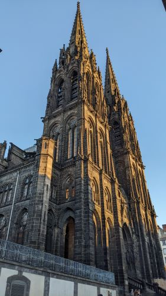  
*La cathédrale Notre-Dame de l'Assomption*

J'y retrouve avec plaisir des speakers déjà rencontrés sur d'autres conférences comme Olivier Poncet, Yannick Guern, Marie-Laure Monplot, Elaine Dias Batista, David Aparicio, Rémy Verchère entre autres.

## Jeudi 12 octobre

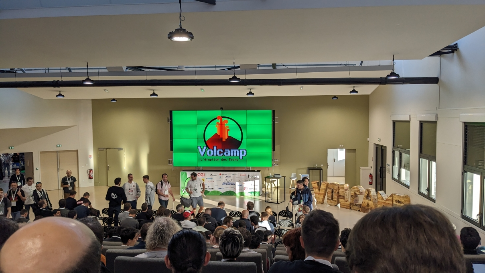
*Photo de la salle de conférence durant l'introduction*

### Keynote

**[Marc Chevaldonné](https://www.linkedin.com/in/marc-chevaldonn%C3%A9-8902a0205/)**

Jeudi matin, en route pour la première journée de conférence.  
Après une petite introduction de l'équipe d'organisation, nous plongeons avec Marc Chevaldonné dans une passionnante histoire de l'informatique, et plus précisément de celle du Xerox PARC.

### Construire soi-même son clavier mécanique, idée bizarre ou idée de génie ?

**[Benjamin Legrand](https://twitter.com/benjilegnard)**

Après la keynote, je suis allée voir Benjamin Legrand qui nous a expliqué que suite à des soucis de santé, il s'était penché sur les claviers mécaniques ergonomiques, ceux qui sont coupés en deux parties.  
Il est même allé plus loin que ça dans sa démarche puisque pour s'en équiper, il a décidé de le construire lui-même grâce aux nombreuses ressources disponibles en ligne.  
Je ne sais pas si je passerai le cap prochainement, mais c'était une belle découverte.  
Pas de sketchnote sur ce sujet, mais voici une petite photo.  

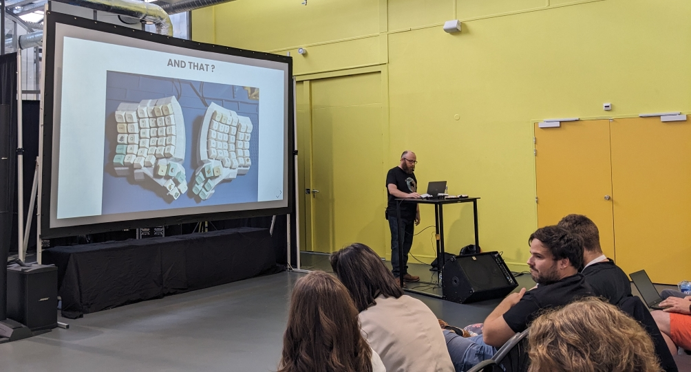
*Photo de Benjamin Legrand durant son talk*

### Comment tester efficacement vos applicatifs d'intelligence artificielle ?

**Sylvain Lequeux et Tom Taranto**
Changement complet de domaine en fin de matinée, avec un talk expliquant comment chez Ekinox on entraîne et teste un modèle d'IA.  
Nul besoin d'être un expert du domaine de l'IA pour comprendre le principe, et c'est toujours intéressant de voir quelle approche peuvent avoir d'autres entreprise au sujet des tests et de la validation.  
Je découvre également qu'un modèle peut devenir obsolète si la distribution des données réelles évolue, et nécessite alors d'être ré-entraîné avec un jeu de données à jour.  

Les sketchnotes que j'ai prises sont ci-dessous.  

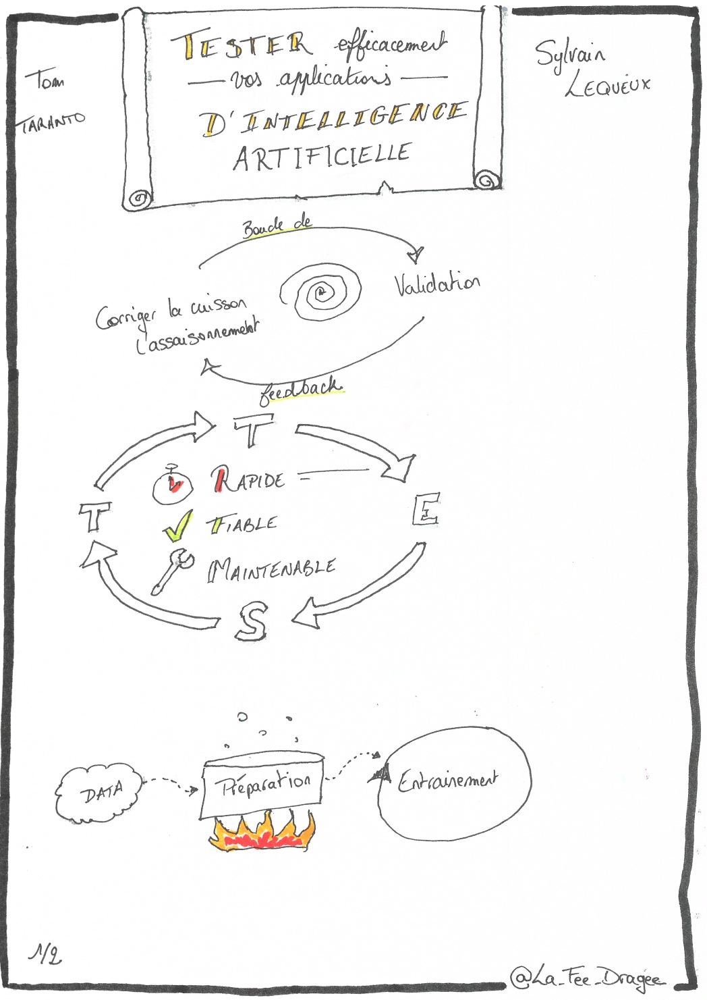
*Sketchnote numéro 1 sur les tests d'IA*

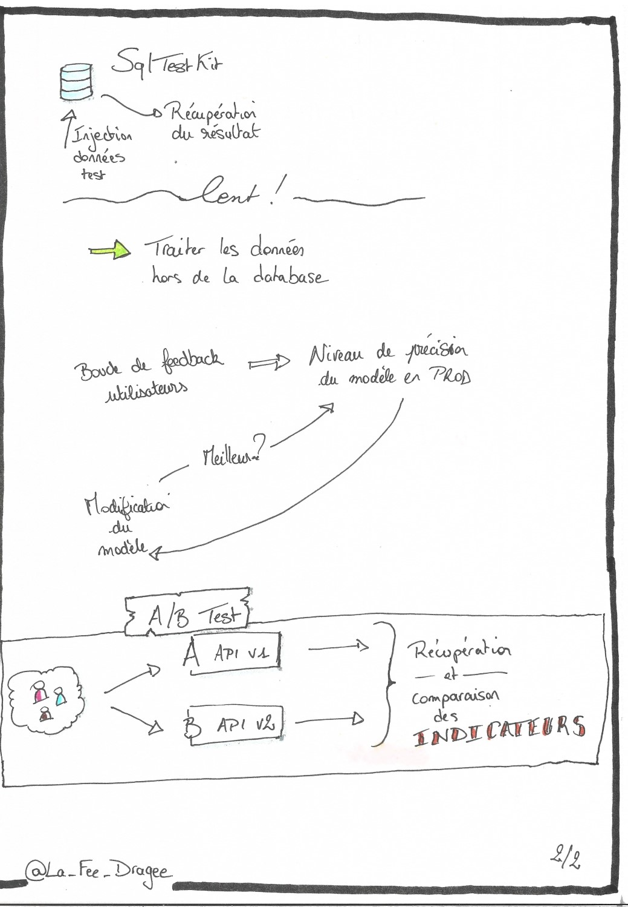
*Sketchnote numéro 2 sur les tests d'IA*

### Pause déjeuner

Au Volcamp, la pause déjeuner c'est du sérieux ! Le jeudi midi nous avons droit à de la truffade, un plat auvergnat à base de pommes de terre, ail et tome fraîche.  
Autant dire qu'après un bon café s'impose pour rester alerte !

*Assiette de truffade et quelques accompagnements*

### Monorepo et Monomythe

**Julien Buret et [François Nollen](https://twitter.com/FrancoisN0)**

En début d'après-midi, je suis allée voir la présentation de Julien Buret et François Nollen nous expliquant comment chez SNCFConnect ils étaient passés au monorepo Git et quelles conséquences cela a eu sur leur façon de travailler, le tout façon voyage du héros en reprenant les 12 étape du monomythe de Campell.  
Ce concept du monorepo peut avoir du sens en fonction du contexte, mais ce que je retiens surtout c'est les différences de pratiques qu'il peut y avoir d'une équipe/entreprise à l'autre, et que ce qui nous paraît courant dans notre quotidien ne l'est peut-être pas encore ailleurs.  

Mes sketchnotes :  

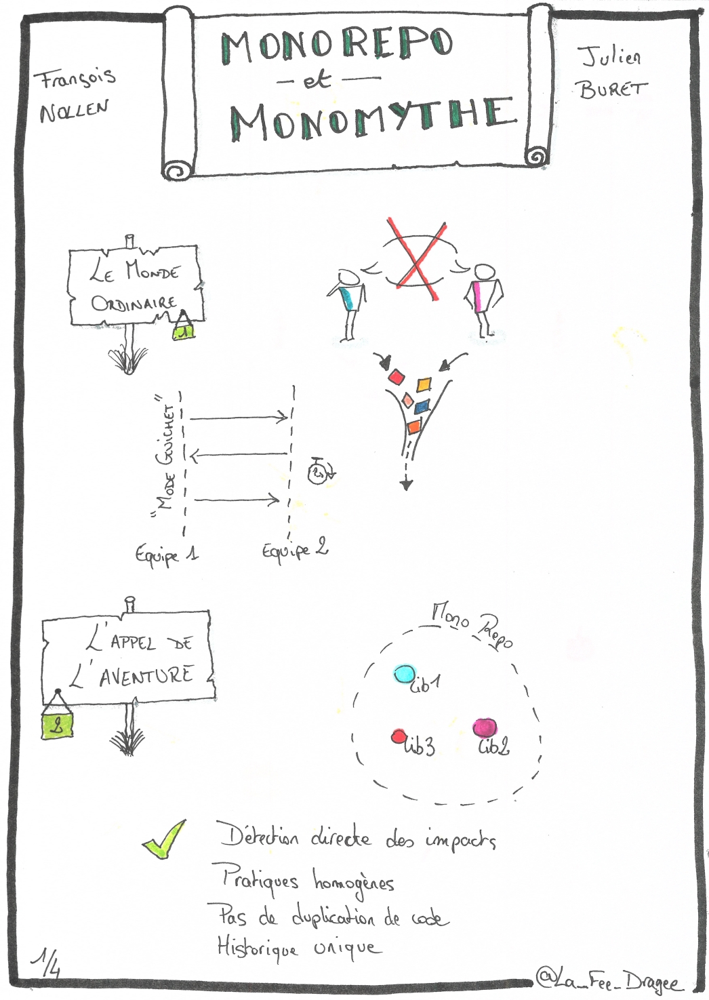
*Sketchnote numéro 1 sur le monorepo*

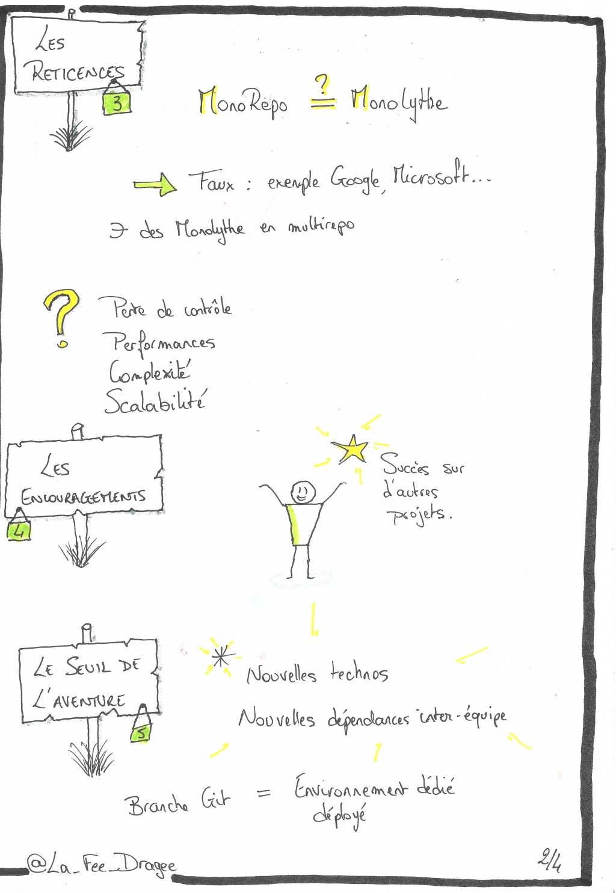
*Sketchnote numéro 2 sur le monorepo*

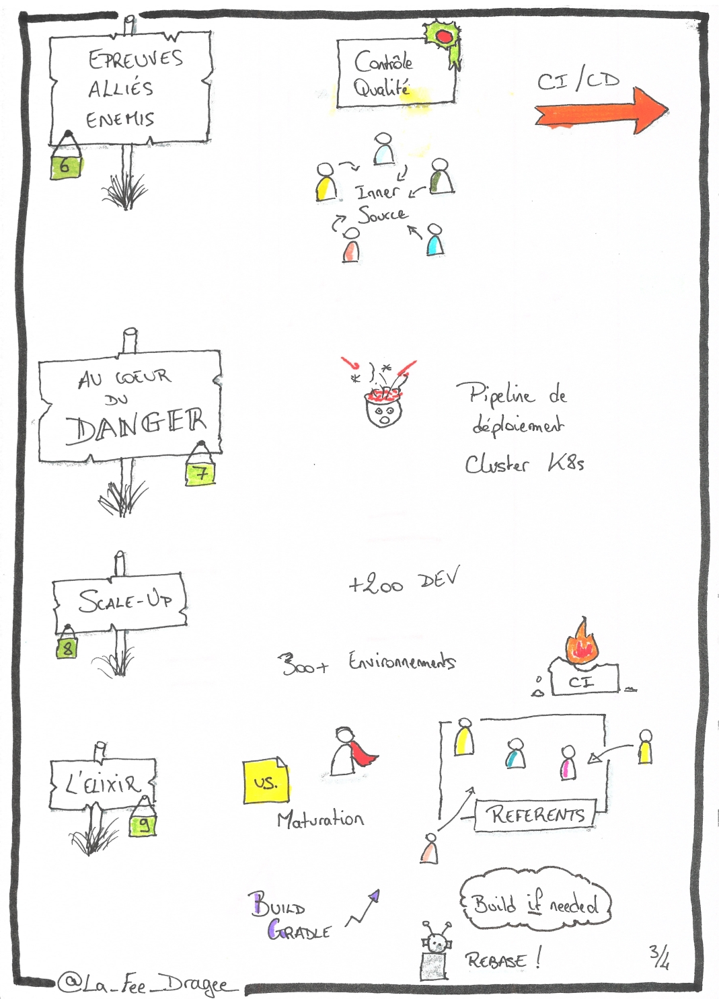
*Sketchnote numéro 3 sur le monorepo*

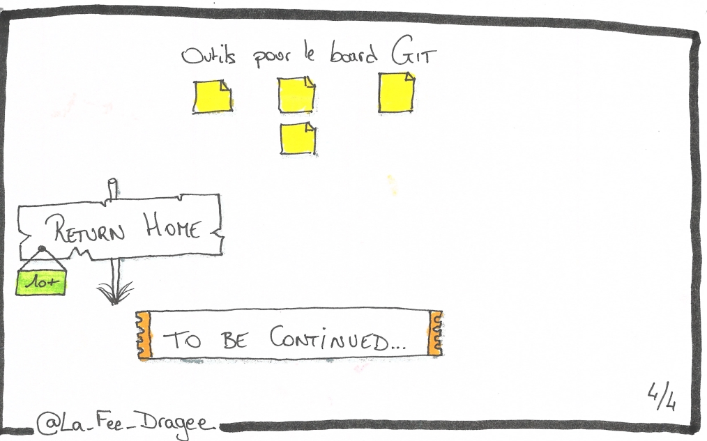
*Sketchnote numéro 4 sur le monorepo*

### Agiliser sans parler Agile

**[Elizabeth Zaslavsky](https://twitter.com/ElizabethZasy)**

Pour finir ma journée, un peu d'agilité avec Elizabeth Zaslavsky qui nous a parlé de la façon dont elle a accompagné un client dans l'industrie pharmaceutique en 2020, qui devait mettre en place une ligne de production de vaccins en un temps record.  
Parce que l'agilité et le scrum ne s'appliquent pas uniquement au monde du développement ! Alors oui, ils ne travaillaient pas en sprints de 2 semaines, et l'équivalent des rétroscpectives se faisait plutôt une fois tous les 2 mois au début, mais ce qui compte c'est d'avoir apporté de la communication et de la collaboration entre les équipes, et une nouvelle façon de voir les choses.  
Une fois données les clés pour avancer, Elizabeth a pu s'éclipser et laisser les équipes grandir par elles-mêmes.  

Les sketchnotes, qui portent davantage sur l'agilité au sens large que sur la mission en question :  

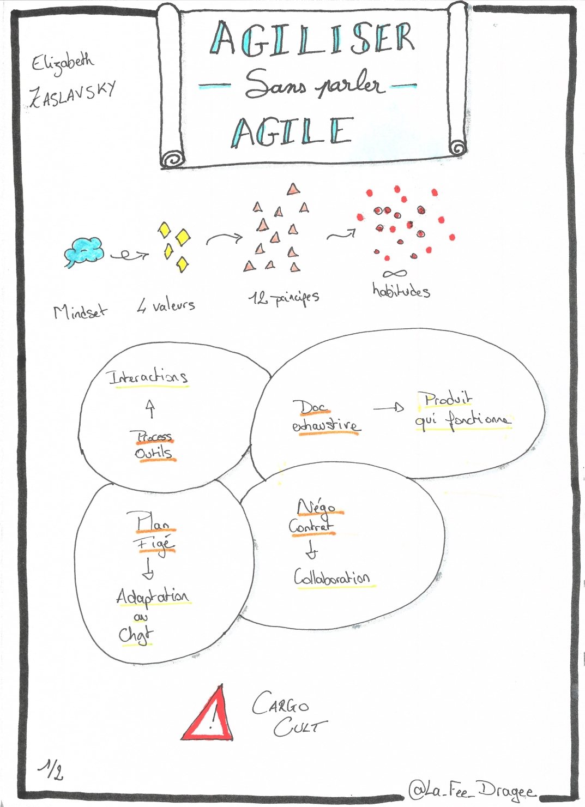
*Sketchnote numéro 1 sur l'agilisation*

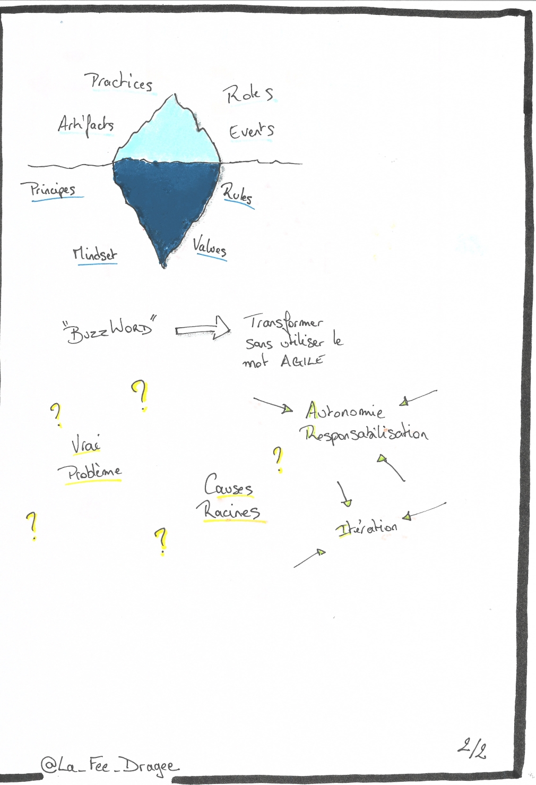
*Sketchnote numéro 2 sur l'agilisation*

### Elles bougent

En fin de journée j'avais prévu de participer à la table ronde au sujet de l'attractivité des sciences et technologies auprès des jeunes filles, animée par Samia Rivière et l'association [Elles bougent !](https://www.ellesbougent.com/).  
Malheureusement la fatigue de la journée l'a emporté, mais sans grand regret car je connais déjà l'association Elles bougent et notamment leur évènement [Elles bougent pour l'orientation](https://orientation.ellesbougent.com/) auquel j'ai participé en 2022.  
Je vous encourage vivement à y jeter un œil !

## Vendredi 13 octobre

Vendredi, c'est le jour de mon talk.  
Devant le présenter à 11h30, j'ai allégé la matinée afin de me préparer en toute sérénité.  

### Keynote

**[Gérald Sadde](https://www.linkedin.com/in/g%C3%A9rald-sadde-3685814/)**

La keynote du vendredi est présentée par Gérald Sadde, avocat spécialisé dans le domaine de l'IT.  
Il nous a parlé de "l'après RGPD", à quoi nous attendre en matière de droit européen sur le numérique.  
Le tout avec une certaine dose d'humour et juste ce qu'il faut d'ironie !  

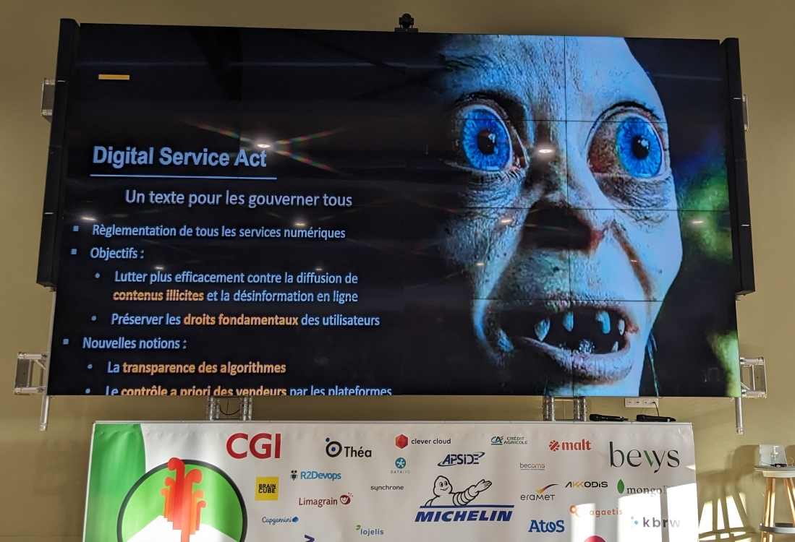
*Photo de la keynote du vendredi*

### Le Zenikasino

Avant d'aller répéter une dernière fois mon talk, je passe au stand Zenika pour saluer [Sylvain Gougouzian](https://twitter.com/GouZ) que j'ai déjà croisé en conférence et qui avait par ailleurs joué le beta-public pour mon talk. 
Une chose est sûre, on ne risque pas de manquer le stand, puisqu'ils ont créé un décor façon casino, et les animateurs sont en costume !  
Je tente ma chance avec le numéro 13 à la roulette, et remporte une participation au tirage au sort pour une PlayStation 5. De quoi avoir la pêche pour le reste de la matinée 🤩.

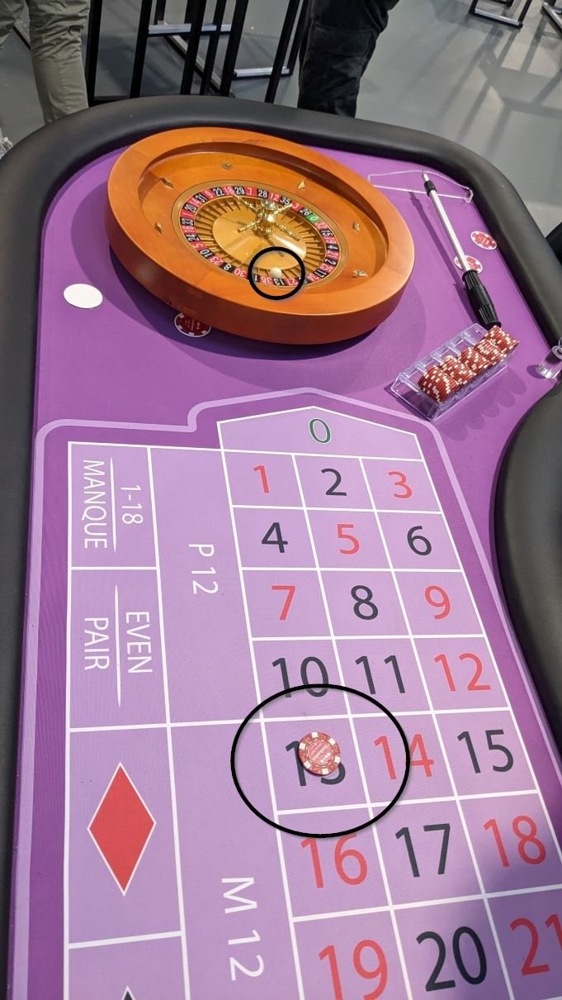
*Photo du jeu de roulette sur le numéro 13*

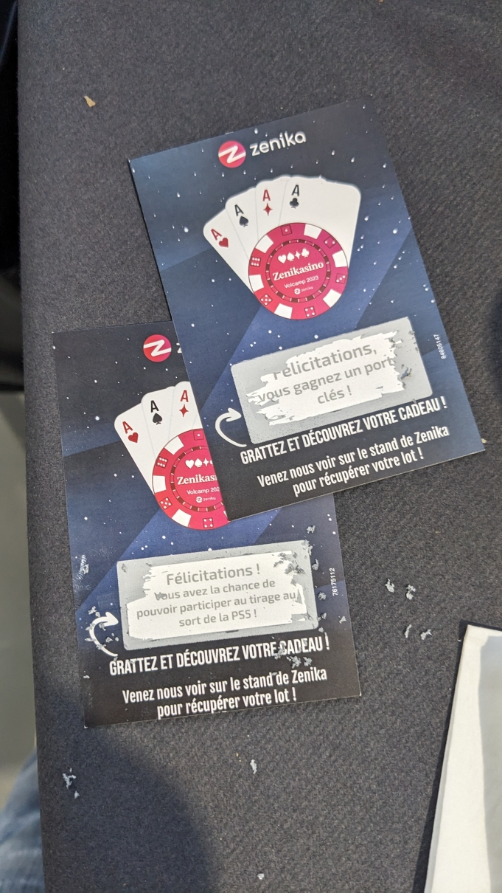
*Photo des cartes à gratter*

### Quelques pistes pour soigner ses traces

C'est la deuxième fois que je donne ce talk en conférence, la première étant au SnowCamp à Grenoble en janvier 2023.  
Je me suis sentie beaucoup moins stressée que la première fois, et j'ai trouvé que la présentation s'était bien passée.  
J'espère qu'elle aura plu 🤞.  

Les slides sont disponibles [sur ce lien]([Volcamp]Quelques%20pistes%20pour%20soigner%20ses%20traces.pdf).

