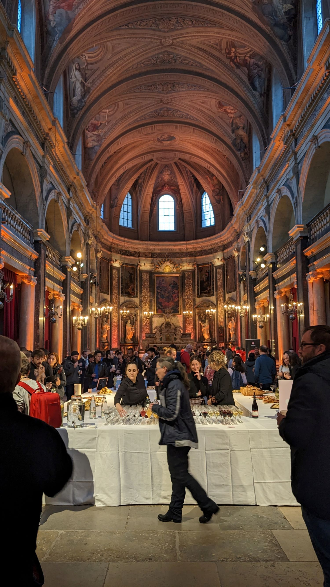

# MiXiT, 25 et 26 avril 2024 - Villeurbanne, France

---
**_Des crêpes, du cœur, des crêpes et du cœur._**

---

C'est ma première venue à MiXiT, une conférence lyonnaise dont j'avais entendu beaucoup de bien.
MiXiT, c'est une conférence un peu à part, où l'on parle un peu de tech mais pas que, on y parle d'éthique, de société, du monde de l'entreprise -_et on y mange des crêpes !_-.  

Elle se déroule sur le campus CPE (Chimie, Physique Electronique) de Lyon, à Villeurbanne, dans un bâtiment que j'ai trouvé très agréable pour l'évènement. Et au détour des stands, entre les sponsors tech "classiques", on trouve des stands d'associations qui œuvrent pour l'humain : [Le Refuge](https://le-refuge.org/), [Soutien Migrants Croix-Rousse](https://www.facebook.com/soutiensmigrantscroixrousse/?locale=fr_FR) et [Anciela](https://www.anciela.info/).  

Pour aider financièrement les associations, l'organisation de MiXiT propose aux visiteurs de donner des _mixettes_ (de petits jetons symbolisant un don de 2€) aux associations.  
Ces _mixettes_ sont financées par des sponsors qui en achètent, 2 sont distribuées à chaque visiteur lorsqu'il récupère son badge, et les autres sont à récupérer soit sur les stands sponsors, soit dans les poches d'un certain Kévin (un vrai humain caché dans la conférence, vêtu d'un t-shirt rayé rouge et blanc).  
Et pour motiver tout ce monde, des cadeaux à gagner pour les plus gros donateurices 😉.

Enfin, un autre élément à part, c'est la présence d'[Antoine Louisgrand](https://www.linkedin.com/in/antoine-louisgrand-1a5681178) et sa nièce [Orane Louisgrand](https://www.instagram.com/orane_louisgrand/) pour immortaliser l'évènement par leurs dessins. En tant qu'artiste également, je suis d'autant plus touchée par la démarche.

## Jeudi 25 avril

### Keynote

**[Olivier ALEXANDRE](https://www.linkedin.com/in/olivier-alexandre-579b5285/?originalSubdomain=fr)**

La keynote d'ouverture donnée par Olivier nous explique comment l'industrie numérique, notamment celle de la Silicon Valley, pèse dans le monde politique et révolutionne le monde e de l'entreprise depuis plusieurs décennies. On y a notamment vu les votes basculer de plus en plus en faveur des républicains, les codes vestimentaires des salariés passer du costume au hoodie corporate, le lieu de travail devenir également un lieu de loisirs. Dans cet espace où la concurrence entre les entreprises est rude, tout est bon pour fidéliser les salariés qui peuvent "traverser la rue pour 100$" selon les propos d'Olivier.  

Pour le côté histoire, la tech existe pour répondre à 3 besoins :  
- le besoin d'information et communication des informations, par exemple avec la naissance du transport ferroviaire nécessitant de savoir quel train passe où et quand, et transporte quoi  
- le besoin d'organisation, rendu possible grâce à la réponse au premier besoin  
- enfin l'intelligence, qui fait le lien entre les différents types d'information 

Les dirigeants des entreprises de pointe dans la tech cherchent incessamment les talents rares pour gagner la course, et un facteur de réussite est également de multiplier les tentatives, et ne pas s'arrêter sur un échec.  
Mais malgré une grande diversité de profils parmi les "petites mains" de la tech (genre, origine ethnique, sexualité), force est de constater que c'est beaucoup moins le cas lorsque l'on regarde les postes hauts placés des entreprises les plus florissantes du secteur. L'effort doit donc continuer pour que contrer cet effacement de diversité dans la hiérarchie.  

### [Atelier] Libère ta créature et embrasse tes bizarreries

**[Cyrielle Eudeline](https://www.linkedin.com/in/cyrielle-eudeline-50608368/)**
**[Maria-eliza Paez](https://www.linkedin.com/in/maria-paez/) _(qui n'a pas pu être présente)_**

Après la sketchnote, je me suis empressée d'aller à l'atelier "Libère ta créature et embrasse tes bizarreries" que j'avais loupé en novembre à l'[Agile Grenoble](../../2023/agile_grenoble/README.md).

L'idée de l'atelier et de nous familiariser avec quelques formes de neuro-atypie, en imaginant l'inconfort potentiel de situations professionnelles classiques.

> _Une remarque en passant, c'est que nous connaissons tous et toutes probablement une personne présentant une forme de neuro-atypisme puisque les personnes concernées représentent environ 13% de la population française : celleux qui écrivent de la main gauche, et passent la plupart de leur temps à s'adapter à une société adaptée aux droitiers·ères._  

Le principe était très simple et efficace puisque les participant·e·s étaient répartis en 5 tables, chacune étant associé à une forme de neuro-atypie (que j'appellerai "profil" par la suite) parmi :
- troubles DYS (dyslexie, dyscalculie, dyspraxie...)  
- TDAH (**T**rouble du **D**éficit de l'**A**ttention avec **H**yperactivité)  
- Asperger (un des **T**roubles du **S**pectre **A**utistique)  
- HPI (**H**aut **P**otentiel **I**ntellectuel)  
- Hypersensible

Nous avions également à disposition une fiche explicative indiquant les "bizarreries" du profil qui nous était associé, comme celles sur l'image ci-dessous.

Puis chaque table a tiré au sort une situation courante de la vie professionnelle, et nous avons alors essayé de lister les difficultés et sources d'inconfort auxquelles notre profil allait devoir faire face.  
A notre table, nous étions dans la peau d'une personne hypersensible, qui passait son entretien annuel.  

Après un partage commun entre les tables, nous avons ensuite imaginé les ajustements qu'il était possible de faire pour contrer ces difficultés.  

Je n'ai pas vu passer le temps, d'autant que j'avais à ma table Aurélie Vache que j'ai toujours plaisir à retrouver en conférences, ainsi qu'Emmanuelle Gouvart avec qui j'ai beaucoup sympathisé.  

Les slides sont toujours disponibles [par ici](https://drive.google.com/file/d/1JIo5kNFwnFYJghJPBfLwtP3vC7VVtqf9/view), n'hésitez pas à les consulter !

### Pause dej et crêpes

Tout est dans le titre, à midi c'est évidemment pause déjeuner avec [La Fine Fourchette](https://www.lafinefourchette.fr/) pour nous régaler durant les 2 journées de conférences.  
Mais la star des papilles à MiXiT ce sont les crêpes de Raph' ! Alors j'ai zappé la keynote de l'après-midi et en ai profité pour aller chercher une crêpe caramel au beurre salé.

### La plus sociale des startup

**Camille Dupont**
**Lilou Miloup**

Bien repue, je me suis dirigée vers le talk de Camille et Lilou parler de syndicalisme et défense des droits des salariés dans une entreprise.  
Le sujet me semble important et intéressant, en revanche je n'ai pas l'impression d'avoir appris beaucoup de choses (mais ce n'a pas été le cas de tout le monde), n'étant pas novice en la matière.  

  

### La communauté trans dans les produits numériques

**[Christopher De Paola](https://www.linkedin.com/in/christopherdepaola-design/)**

Pendant un format "lightning" de 20 minutes, Christopher, homme trans (donc né·e femme) est venu nous parler de l'absence de place pour les personnes trans dans les services numériques, et des impacts parfois vitaux que cela peut parfois avoir (en plus des régulières discriminations dont les personnes peuvent faire l'objet de la part des autres humains).  
Sa présentation a été très inspirante pour moi, sur bien des aspects, et reflète parfaitement ce qu'est la conférence **MiXiT**.  

Je retiens par exemple l'anecdote de l'examen médical n'ayant pu être effectué car réalisable uniquement sur les femmes, or Christopher avait déjà changé d'état civil, et donc inscrit dans le logiciel en tant qu'homme, or ledit logiciel ne proposait pas l'examen en question pour un patient homme...  

Une autre chose dont on ne se rend pas compte dans les toutes ces interfaces d'inscription, c'est que ça peut également amener à révéler contre sa volonté le fait qu'une personne est trans (on dit également _outer_), par exemple lorsque l'on doit indiquer son identité civile, avec donc un genre et un prénom qui ne sont plus d'usage.  

Notons au passage qu'il n'est pas obligatoire d'indiquer "monsieur" ou "madame" sur un document, et d'ailleurs la DGFIP ne le fait plus depuis 2022 [voir ici](https://www.lepoint.fr/societe/les-courriers-des-impots-ne-mentionneront-plus-monsieur-ni-madame-16-07-2022-2483493_23.php).  
A l'instar du remplacement des fameux "_nom de jeune fille/nom d'épouse_" qu'on délaissera au profit de "_nom de naissance/nom marital_", il est plus que temps de remplacer les _M/Mme_ par le pronom choisi par l'utilisateur·ice.  

Et pour finir, un argument que je trouve extrêmement pertinent et puissant, c'est qu'en laissant de la place pour les personnes atypiques (LGBT+, neuroatypiques, en situation de handicap) dans nos produits, plus le reste de la population prendra conscience de leur existence.

  

### Réunions en non-mixité choisie, un moteur pour féminiser sa boîte

**[Laury Maurice](https://www.linkedin.com/in/laury-maurice-874758b0/)**

Sur un format de 20 minutes également, Laury nous a expliqué comment au sein de Shodo était né un groupe de réflexion non-mixte ayant pour but d'apporter davantage d'égalité de genre dans l'entreprise.  

Bien évidemment, tout ne s'est pas fait du jour au lendemain, mais grâce à leurs réflexions et à l'écoute des dirigeants, de nombreuses mesures ont été mises en place, et le nombre de femmes dans l'entreprise a doublé en moins d'un an !  

Vous pouvez retrouver un très bon résumé directement sur le site de Shodo : [https://shodo.io/notre-lutte-pour-legalite-de-genre/](https://shodo.io/notre-lutte-pour-legalite-de-genre/).  

### Soirée à la chapelle de la trinité

Outre les crêpes, s'il y a une chose à ne pas rater à MiXiT c'est la soirée !  
Jeudi soir le rendez-vous était donné à la chapelle de la trinité, magnifique lieu pour continuer à discuter et faire des rencontres.  

Seul bémol : la nourriture. Si durant la conférence la _Fine Fourchette_ avait des alternatives adaptées (et de qualité) aux différents régimes alimentaires (végétar·lien, sans lactose, sans gluten...) pour les repas du midi, ce n'était pas le cas pour la soirée où il s'agissait d'un autre traiteur, et plusieurs personnes n'ont malheureusement pas pu profiter du buffet (qui au demeurant était très bon !).

Durant la soirée j'ai pu profiter d'une animation son et lumière basée sur le nombre de personnes en contact physique avec le dispositif. Plus il y a de gens, plus il y avait de pistes sonores. C'était très chouette.  

J'ai également échangé un moment avec Antoine Louisgrand, qui en a profité pour faire mon portrait que j'ai récupéré le lendemain ❤️.  

## Vendredi 26 avril

_[Bientôt disponible]_

<!--### Figma-->

<!--Possible d'exécuter en mode démo pour tester les interfaces créer avant de développer l'appli pour de vrai.-->