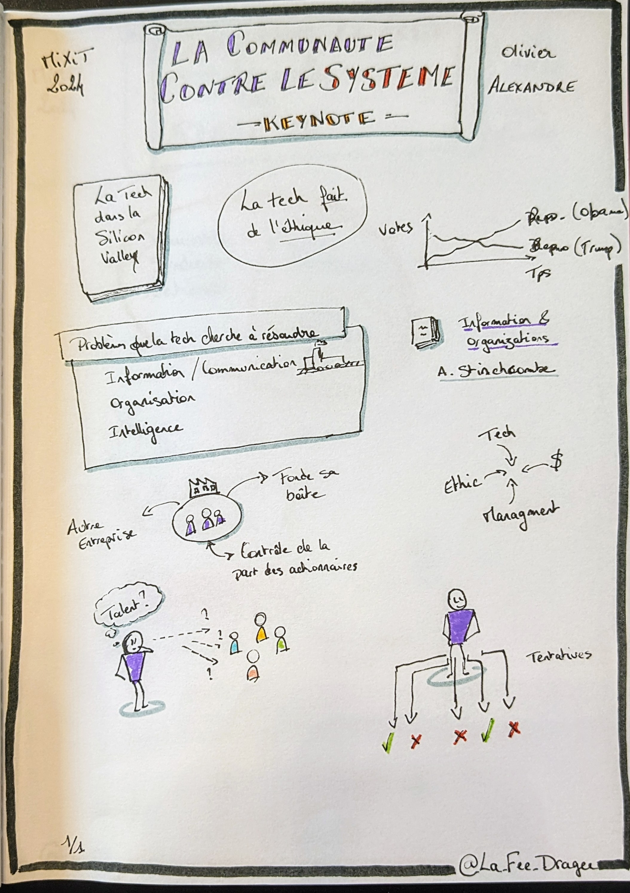
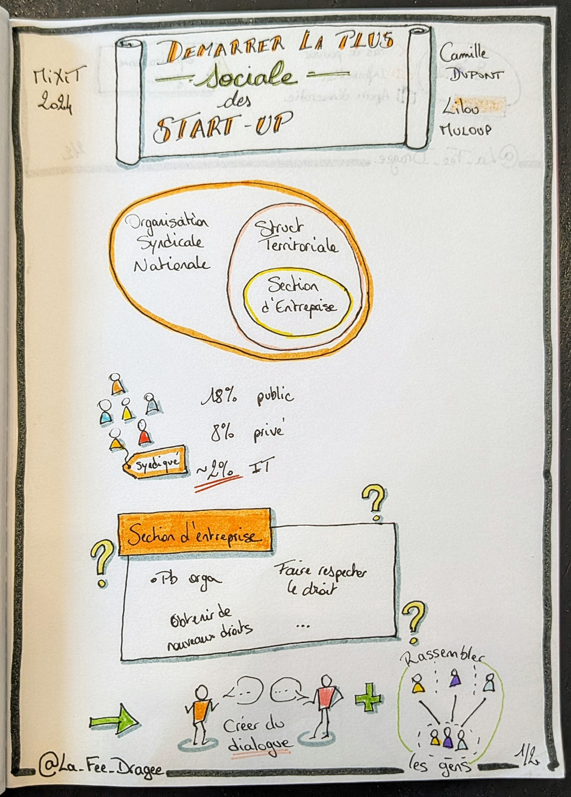
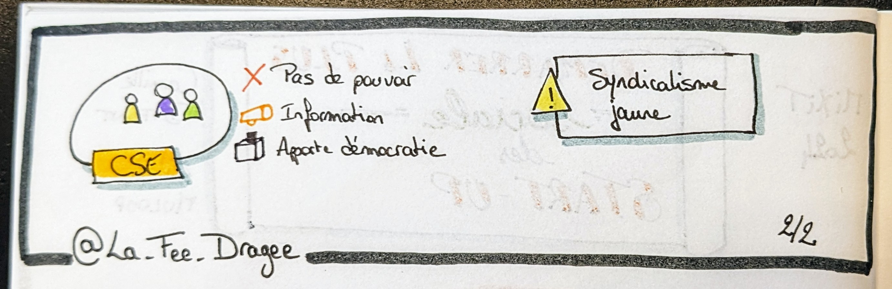

# MiXiT, 25 et 26 avril 2024 - Villeurbanne, France

---
**_Des crêpes, du cœur, des crêpes et du cœur._**

---

C'est ma première venue à MiXiT, une conférence lyonnaise dont j'avais entendu beaucoup de bien.
MiXiT, c'est une conférence un peu à part, où l'on parle un peu de tech mais pas que, on y parle d'éthique, de société, du monde de l'entreprise -_et on y mange des crêpes !_-.  

Elle se déroule sur le campus CPE (Chimie, Physique Electronique) de Lyon, à Villeurbanne, dans un bâtiment que j'ai trouvé très agréable pour l'évènement. Et au détour des stands, entre les sponsors tech "classiques", on trouve des stands d'associations qui œuvrent pour l'humain : [Le Refuge](https://le-refuge.org/), [Soutien Migrants Croix-Rousse](https://www.facebook.com/soutiensmigrantscroixrousse/?locale=fr_FR) et [Anciela](https://www.anciela.info/). <!--citer les assos-->

<!--parler des mixettes-->

## Jeudi 25 avril

### Keynote

**[Olivier ALEXANDRE](https://www.linkedin.com/in/olivier-alexandre-579b5285/?originalSubdomain=fr)**

La keynote d'ouverture donnée par Olivier nous explique comment l'industrie numérique, notamment celle de la Silicon Valley, pèse dans le monde politique et révolutionne le monde e de l'entreprise depuis plusieurs décennies. On y a notamment vu les votes basculer de plus en plus en faveur des républicains, les codes vestimentaires des salariés passer du costume au hoodie corporate, le lieu de travail devenir également un lieu de loisirs. Dans cet espace où la concurrence entre les entreprises est rude, tout est bon pour fidéliser les salariés qui peuvent "traverser la rue pour 100$" selon les propos d'Olivier.  

Pour le côté histoire, la tech existe pour répondre à 3 besoins :  
- le besoin d'information et communication des informations, par exemple avec la naissance du transport ferroviaire nécessitant de savoir quel train passe où et quand, et transporte quoi  
- le besoin d'organisation, rendu possible grâce à la réponse au premier besoin  
- enfin l'intelligence, qui fait le lien entre les différents types d'information 

Les dirigeants des entreprises de pointe dans la tech cherchent incessamment les talents rares pour gagner la course, et un facteur de réussite est également de multiplier les tentatives, et ne pas s'arrêter sur un échec.  
Mais malgré une grande diversité de profils parmi les "petites mains" de la tech (genre, origine ethnique, sexualité), force est de constater que c'est beaucoup moins le cas lorsque l'on regarde les postes hauts placés des entreprises les plus florissantes du secteur. L'effort doit donc continuer pour que contrer cet effacement de diversité dans la hiérarchie.  

### [Atelier] Libère ta créature et embrasse tes bizarreries

**[Cyrielle Eudeline](https://www.linkedin.com/in/cyrielle-eudeline-50608368/)**
**[Maria-eliza Paez](https://www.linkedin.com/in/maria-paez/) _(qui n'a pas pu être présente)_**

Après la sketchnote, je me suis empressée d'aller à l'atelier "Libère ta créature et embrasse tes bizarreries" que j'avais loupé en novembre à l'[Agile Grenoble](../../2023/agile_grenoble/README.md).

L'idée de l'atelier et de nous familiariser avec quelques formes de neuro-atypie, en imaginant l'inconfort potentiel de situations professionnelles classiques.

> _Une remarque en passant, c'est que nous connaissons tous et toutes probablement une personne présentant une forme de neuro-atypisme puisque les personnes concernées représentent environ 13% de la population française : celleux qui écrivent de la main gauche, et passent la plupart de leur temps à s'adapter à une société adaptée aux droitiers·ères._  

Le principe était très simple et efficace puisque les participant·e·s étaient répartis en 5 tables, chacune étant associé à une forme de neuro-atypie (que j'appellerai "profil" par la suite) parmi :
- troubles DYS (dyslexie, dyscalculie, dyspraxie...)  
- TDAH (**T**rouble du **D**éficit de l'**A**ttention avec **H**yperactivité)  
- Asperger (un des **T**roubles du **S**pectre **A**utistique)  
- HPI (**H**aut **P**otentiel **I**ntellectuel)  
- Hypersensible

Nous avions également à disposition une fiche explicative indiquant les "bizarreries" du profil qui nous était associé, comme celles sur l'image ci-dessous.

Puis chaque table a tiré au sort une situation courante de la vie professionnelle, et nous avons alors essayé de lister les difficultés et sources d'inconfort auxquelles notre profil allait devoir faire face.  
A notre table, nous étions dans la peau d'une personne hypersensible, qui passait son entretien annuel.  

Après un partage commun entre les tables, nous avons ensuite imaginé les ajustements qu'il était possible de faire pour contrer ces difficultés.  

Je n'ai pas vu passer le temps, d'autant que j'avais à ma table Aurélie Vache que j'ai toujours plaisir à retrouver en conférences, ainsi qu'Emmanuelle Gouvart avec qui j'ai beaucoup sympathisé.  

Les slides sont toujours disponibles [par ici](https://drive.google.com/file/d/1JIo5kNFwnFYJghJPBfLwtP3vC7VVtqf9/view), n'hésitez pas à les consulter !

### Pause dej et crêpes

Tout est dans le titre, à midi c'est évidemment pause déjeuner avec [La Fine Fourchette](https://www.lafinefourchette.fr/) pour nous régaler durant les 2 journées de conférences.  
Mais la star des papilles à MiXiT ce sont les crêpes de Raph' ! Alors j'ai zappé la keynote de l'après-midi et en ai profité pour aller chercher une crêpe caramel au beurre salé.

### La plus sociale des startup

**Camille Dupont**
**Lilou Miloup**

Bien repue, je me suis dirigée vers le talk de Camille et Lilou parler de syndicalisme et défense des droits des salariés dans une entreprise.  
Le sujet me semble important et intéressant, en revanche je n'ai pas l'impression d'avoir appris beaucoup de choses (mais ce n'a pas été le cas de tout le monde), n'étant pas novice en la matière.  

  

### La communauté trans dans les produits numériques

### Réunions en non-mixité @shodo

### Soirée à la chapelle de la trinité

## Vendredi 26 avril

### Figma

<!--Possible d'exécuter en mode démo pour tester les interfaces créer avant de développer l'appli pour de vrai.-->